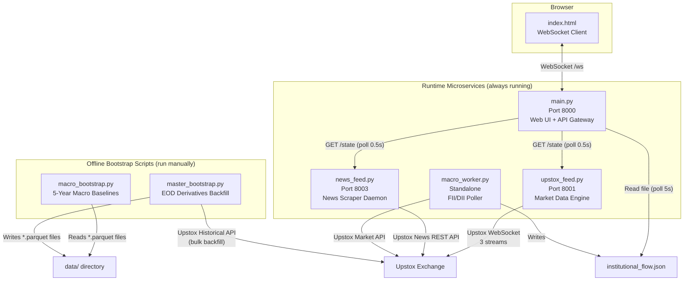
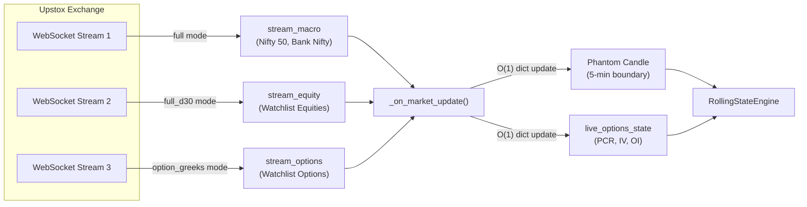
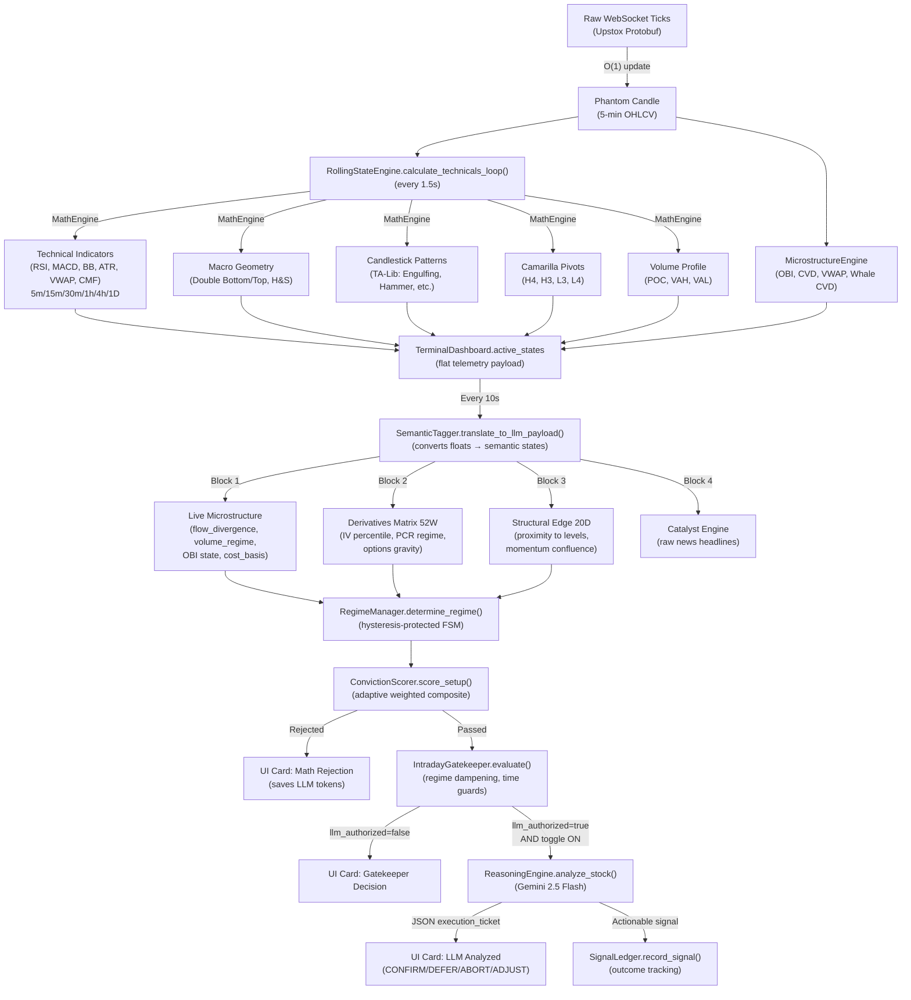
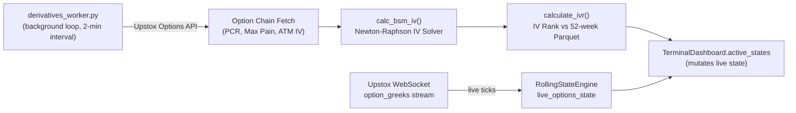

# AlgoTrade Trading Copilot — Full Architecture Summary

> **Traced from**: `main.py`, `upstox_feed.py`, `macro_worker.py`, `news_feed.py`, `master_bootstrap.py`, `macro_bootstrap.py` and **all 30+ transitive dependencies**.

---

## 1. System Topology — Four Microservices + Two Offline Scripts

The system runs as **4 independent Python processes** communicating via **HTTP REST APIs** (inter-service polling) and a **WebSocket** (to the browser UI). Two additional offline scripts handle historical data accumulation.



### Port Map

| Process | Port | Protocol | Role |
|---|---|---|---|
| [main.py](file:///c:/Users/niltk/OneDrive/Desktop/SKILLS/Projects/AlgoTrade/trading_copilot/main.py) | **8000** | HTTP + WebSocket | API Gateway, Web UI, LLM Reasoning |
| [upstox_feed.py](file:///c:/Users/niltk/OneDrive/Desktop/SKILLS/Projects/AlgoTrade/trading_copilot/data_services/upstox_feed.py) | **8001** | HTTP | Market Data Feed, Rolling State Engine |
| [news_feed.py](file:///c:/Users/niltk/OneDrive/Desktop/SKILLS/Projects/AlgoTrade/trading_copilot/data_services/news_feed.py) | **8003** | HTTP | News Scraping, Catalyst Analysis |
| [macro_worker.py](file:///c:/Users/niltk/OneDrive/Desktop/SKILLS/Projects/AlgoTrade/trading_copilot/data_services/macro_worker.py) | — | File I/O | FII/DII Data (runs daily at 18:30 IST) |

---

## 2. Process Deep-Dive

### 2.1 `main.py` → API Gateway & Orchestrator (Port 8000)

**Entry**: `asyncio.run(run_system())` → `start_api_server()`

This is the **user-facing brain** of the system. It hosts the FastAPI web server, the real-time WebSocket, and orchestrates the LLM reasoning pipeline.

#### Startup Sequence
1. Loads saved playbook state from [playbook_state.json](file:///c:/Users/niltk/OneDrive/Desktop/SKILLS/Projects/AlgoTrade/trading_copilot/playbook_state.json)
2. Spawns 4 background `asyncio.create_task()` loops:

| Background Task | Module | Interval | Purpose |
|---|---|---|---|
| `poll_upstox()` | [api_server.py:39](file:///c:/Users/niltk/OneDrive/Desktop/SKILLS/Projects/AlgoTrade/trading_copilot/api_server.py#L39) | 0.5s | Polls `upstox_feed` `/state` endpoint for live market data |
| `poll_nse()` | [api_server.py:53](file:///c:/Users/niltk/OneDrive/Desktop/SKILLS/Projects/AlgoTrade/trading_copilot/api_server.py#L53) | 5s | Reads `institutional_flow.json` from disk (written by `macro_worker`) |
| `poll_news()` | [api_server.py:67](file:///c:/Users/niltk/OneDrive/Desktop/SKILLS/Projects/AlgoTrade/trading_copilot/api_server.py#L67) | 0.5s | Polls `news_feed` `/state` endpoint for catalyst cache |
| `start_global_gatekeeper_loop()` | [reasoning_engine.py:425](file:///c:/Users/niltk/OneDrive/Desktop/SKILLS/Projects/AlgoTrade/trading_copilot/reasoning_engine.py#L425) | 10s | The autonomous analysis engine (see §3) |

#### Key Dependencies
- [api_server.py](file:///c:/Users/niltk/OneDrive/Desktop/SKILLS/Projects/AlgoTrade/trading_copilot/api_server.py) — FastAPI app with 25+ endpoints
- [reasoning_engine.py](file:///c:/Users/niltk/OneDrive/Desktop/SKILLS/Projects/AlgoTrade/trading_copilot/reasoning_engine.py) — LLM-powered decision engine (Gemini 2.5 Flash)
- [diagnostic_ui.py](file:///c:/Users/niltk/OneDrive/Desktop/SKILLS/Projects/AlgoTrade/trading_copilot/diagnostic_ui.py) — Shared state singleton (`TerminalDashboard.active_states`)
- [history_manager.py](file:///c:/Users/niltk/OneDrive/Desktop/SKILLS/Projects/AlgoTrade/trading_copilot/history_manager.py) — Trade ledger persistence
- [performance_analyzer.py](file:///c:/Users/niltk/OneDrive/Desktop/SKILLS/Projects/AlgoTrade/trading_copilot/performance_analyzer.py) — Signal performance analytics

---

### 2.2 `upstox_feed.py` → Market Data Engine (Port 8001)

**Entry**: `asyncio.run(start_upstox_service())`

This is the **data backbone** of the entire system. It authenticates with Upstox, fetches historical warmup data, opens 3 concurrent WebSocket streams, and maintains real-time state for all instruments.

#### Startup Sequence
1. **Authentication** → [UpstoxAuthenticator](file:///c:/Users/niltk/OneDrive/Desktop/SKILLS/Projects/AlgoTrade/trading_copilot/data_services/upstox_feed.py#L44) performs OAuth2 PKCE flow (headless Playwright or manual fallback)
2. **Watchlist Load** → Reads [watchlist.csv](file:///c:/Users/niltk/OneDrive/Desktop/SKILLS/Projects/AlgoTrade/trading_copilot/watchlist.csv)
3. **Scrip Master Download** → [scrip_master_engine.py](file:///c:/Users/niltk/OneDrive/Desktop/SKILLS/Projects/AlgoTrade/trading_copilot/scrip_master_engine.py) downloads full NSE instrument master
4. **Historical Warmup** → [HistoricalFetcher](file:///c:/Users/niltk/OneDrive/Desktop/SKILLS/Projects/AlgoTrade/trading_copilot/historical_engine.py#L8) fetches:
   - Nifty 50 baseline (100 days, daily) for Relative Strength
   - Per-symbol LTF (30 days, 5-min candles) and HTF (100 days, daily candles)
5. **Rolling State Engine Init** → [RollingStateEngine](file:///c:/Users/niltk/OneDrive/Desktop/SKILLS/Projects/AlgoTrade/trading_copilot/rolling_state_engine.py#L21) initialized with warmup DataFrames, or hydrated from cache
6. Spawns 4 background tasks:

| Background Task | Module | Purpose |
|---|---|---|
| `start_multiplexer()` | [UpstoxStreamManager](file:///c:/Users/niltk/OneDrive/Desktop/SKILLS/Projects/AlgoTrade/trading_copilot/data_services/upstox_feed.py#L218) | Opens 3 WebSocket streams (indices, equities, options) |
| `calculate_technicals_loop()` | [RollingStateEngine](file:///c:/Users/niltk/OneDrive/Desktop/SKILLS/Projects/AlgoTrade/trading_copilot/rolling_state_engine.py#L241) | Calculates technicals every 1.5s |
| `derivatives_poller_loop()` | [derivatives_worker.py](file:///c:/Users/niltk/OneDrive/Desktop/SKILLS/Projects/AlgoTrade/trading_copilot/derivatives_worker.py#L197) | Polls option chain REST API every 2 min |
| `state_persistence_worker()` | Inline | Saves rolling state cache every 5 min |

#### Tri-Stream WebSocket Architecture



---

### 2.3 `news_feed.py` → News Scraper Daemon (Port 8003)

**Entry**: `asyncio.run(test_news_api())` → `start_service()`

A FastAPI microservice that fetches news from Upstox News API and uses Gemini to analyze macro sentiment.

#### Background Loops

| Loop | Interval | Purpose |
|---|---|---|
| `_news_polling_loop()` | 120s | Per-symbol news from Upstox News API |
| `_macro_news_polling_loop()` | 1800s (30 min) | Macro context via 10 proxy heavyweight stocks → Gemini sentiment analysis |

#### Key Data Flow
1. Fetches news articles per watchlist symbol via Upstox News API
2. Stores raw headlines in `NewsEngine.catalyst_cache` (per-symbol)
3. Macro headlines → Gemini LLM → Produces `macro_context` (sentiment + summary)
4. Both caches exposed via `GET /state` endpoint, polled by `main.py`

---

### 2.4 `macro_worker.py` → Institutional Flow Tracker (Standalone)

**Entry**: `asyncio.run(macro_poller_loop(api))` — or runs embedded from `upstox_feed.py`

A lightweight daemon that fetches FII/DII buy/sell cash data from Upstox Market API.

- Runs **once per day at 18:30 IST**, then sleeps until next day
- Writes to [data/institutional_flow.json](file:///c:/Users/niltk/OneDrive/Desktop/SKILLS/Projects/AlgoTrade/trading_copilot/data/institutional_flow.json)
- Read by `api_server.py` via `poll_nse()` and by `RollingStateEngine` via `InstitutionalFlowTracker.load_state()`

---

## 3. The Signal Processing Pipeline (The Brain)

This is the core autonomous trading intelligence pipeline. It runs every **10 seconds** via `start_global_gatekeeper_loop()`.



### 3.1 Layer 1 — Deterministic Math Engine

| Module | File | Role |
|---|---|---|
| **MicrostructureEngine** | [microstructure_engine.py](file:///c:/Users/niltk/OneDrive/Desktop/SKILLS/Projects/AlgoTrade/trading_copilot/microstructure_engine.py) | Real-time OBI, CVD, Whale CVD, Session VWAP, intraday POC |
| **MathEngine** | [technical_engine.py](file:///c:/Users/niltk/OneDrive/Desktop/SKILLS/Projects/AlgoTrade/trading_copilot/technical_engine.py) | RSI, MACD, Bollinger, ATR, VWAP, CMF, Geometry, Candlesticks, Camarilla, Omni-TF (5m→4h) |
| **SemanticTagger** | [semantic_tagger.py](file:///c:/Users/niltk/OneDrive/Desktop/SKILLS/Projects/AlgoTrade/trading_copilot/semantic_tagger.py) | Converts raw floats → institutional semantic states (e.g., `vol_z > 2.5` → `TIME_ADJUSTED_SHOCK`) |
| **RegimeManager** | [regime_manager.py](file:///c:/Users/niltk/OneDrive/Desktop/SKILLS/Projects/AlgoTrade/trading_copilot/regime_manager.py) | Hysteresis-protected FSM: `TREND_EXPANSION`, `PRE_BREAKOUT_SQUEEZE`, `RANGE_BOUND_CHOP`, `MEAN_REVERSION_IMMINENT`, `TRANSITIONAL_DRIFT` |
| **ConvictionScorer** | [conviction_scorer.py](file:///c:/Users/niltk/OneDrive/Desktop/SKILLS/Projects/AlgoTrade/trading_copilot/conviction_scorer.py) | 13-signal weighted composite → directional bias → execution geometry (entry/stop/target) → expectancy matrix |
| **IntradayGatekeeper** | [intraday_gatekeeper.py](file:///c:/Users/niltk/OneDrive/Desktop/SKILLS/Projects/AlgoTrade/trading_copilot/intraday_gatekeeper.py) | Final deterministic sieve: time guards, regime dampening, active position management, LLM authorization gate |

### 3.2 Layer 2 — Qualitative LLM Judge

| Module | File | Role |
|---|---|---|
| **ReasoningEngine** | [reasoning_engine.py](file:///c:/Users/niltk/OneDrive/Desktop/SKILLS/Projects/AlgoTrade/trading_copilot/reasoning_engine.py) | Gemini 2.5 Flash API call with full structured payload. Outputs `execution_ticket` (CONFIRM/DEFER/ABORT/ADJUST). 15-concurrent semaphore. |

### 3.3 Layer 3 — Feedback Loop

| Module | File | Role |
|---|---|---|
| **SignalLedger** | [signal_ledger.py](file:///c:/Users/niltk/OneDrive/Desktop/SKILLS/Projects/AlgoTrade/trading_copilot/signal_ledger.py) | Records every LLM-authorized signal. Tracks 30m and 60m outcome (directional accuracy, stop/target hit). JSONL per-day log. |
| **PerformanceAnalyzer** | [performance_analyzer.py](file:///c:/Users/niltk/OneDrive/Desktop/SKILLS/Projects/AlgoTrade/trading_copilot/performance_analyzer.py) | Computes win rates, profit factor, regime accuracy. Fed back into ConvictionScorer adaptive weights and LLM prompt calibration. |

---

## 4. Derivatives Data Pipeline

A parallel pipeline that enriches the main state with options data.



**Two sources of derivatives data:**
1. **REST Polling** ([derivatives_worker.py](file:///c:/Users/niltk/OneDrive/Desktop/SKILLS/Projects/AlgoTrade/trading_copilot/derivatives_worker.py)) — Full chain fetch every 2 min for PCR, Max Pain, ATM IV
2. **WebSocket Streaming** — Real-time option greeks via `stream_options` (CE/PE OI, live PCR, IV)

---

## 5. Offline Bootstrap Scripts

### 5.1 `master_bootstrap.py` — EOD Derivatives Backfill

[master_bootstrap.py](file:///c:/Users/niltk/OneDrive/Desktop/SKILLS/Projects/AlgoTrade/trading_copilot/scripts/master_bootstrap.py)

A heavyweight offline script that populates the `*_1D.parquet` files with historical derivatives metrics.

**Two-Pass Architecture:**
1. **Pass 1: OHLCV Sync** — Fetches missing daily candles for all watchlist symbols
2. **Pass 2: EOD Derivatives Backfill** — For each missing trading day:
   - Fetches all expired option contracts for the symbol
   - Downloads candle data for each contract
   - Calculates: **PCR**, **Total OI**, **Max Pain**, **EOD IV** (via Newton-Raphson)
   - Updates the parquet file

**Rate Limiting**: Custom `RateLimiter` class with 0.12s inter-request delay and 30-minute cooldown on HTTP 429.

### 5.2 `macro_bootstrap.py` — 5-Year Macro Baselines

[macro_bootstrap.py](file:///c:/Users/niltk/OneDrive/Desktop/SKILLS/Projects/AlgoTrade/trading_copilot/scripts/macro_bootstrap.py)

Processes all `*_1D.parquet` files to generate [macro_baselines.json](file:///c:/Users/niltk/OneDrive/Desktop/SKILLS/Projects/AlgoTrade/trading_copilot/data/macro_baselines.json).

**Computed Metrics per Symbol:**

| Category | Metrics |
|---|---|
| **Volatility Edge (52W)** | IV Percentile, IV 52W High/Low, Historical Vol 20D |
| **Options Positioning (52W)** | PCR Percentile, OI Volume Shock Z-Score, 20D Strike Migration Drift |
| **Structural Liquidity (5Y)** | Volume POC Price, Value Area High/Low (70% rule) |
| **Regime Confluence (5Y)** | Macro Trend Alignment (SMA 50/200), CAPM Beta, Simplified Alpha |

---

## 6. Persistent State Files

| File | Written By | Read By | Purpose |
|---|---|---|---|
| [watchlist.csv](file:///c:/Users/niltk/OneDrive/Desktop/SKILLS/Projects/AlgoTrade/trading_copilot/watchlist.csv) | `api_server.py` (via UI) | All processes | Active instrument universe |
| [upstox_token.json](file:///c:/Users/niltk/OneDrive/Desktop/SKILLS/Projects/AlgoTrade/trading_copilot/upstox_token.json) | `UpstoxAuthenticator` | All Upstox API consumers | OAuth2 access token (24h TTL) |
| `data/institutional_flow.json` | `macro_worker.py` | `api_server.py`, `RollingStateEngine` | FII/DII daily net flow |
| `data/cache_state.json` | `RollingStateEngine` (every 5 min) | `RollingStateEngine` (on startup) | Anti-cold-start: phantom candles, options state, daily metrics |
| `data/macro_baselines.json` | `macro_bootstrap.py` | `RollingStateEngine`, `derivatives_worker.py` | 5-year historical baselines |
| `data/*_1D.parquet` | `master_bootstrap.py`, `parquet_engine.py` | `macro_bootstrap.py`, `derivatives_worker.py`, `RollingStateEngine` | Per-symbol daily OHLCV + EOD derivatives |
| `data/signals/signal_log_*.jsonl` | `SignalLedger` | `PerformanceAnalyzer` | Per-day signal outcome tracking |
| `playbook_state.json` | `ReasoningEngine` | `api_server.py` (on startup) | Saved intraday playbook (LLM-generated) |
| `.env` | Manual | `config.py`, `upstox_feed.py` | API keys (Upstox, Gemini), credentials |

---

## 7. Full Module Dependency Map

```mermaid
graph TD
    main["main.py"] --> api_server["api_server.py"]
    api_server --> diagnostic_ui["diagnostic_ui.py"]
    api_server --> config["config.py"]
    api_server --> reasoning_engine["reasoning_engine.py"]
    api_server --> history_manager["history_manager.py"]
    api_server --> performance_analyzer["performance_analyzer.py"]
    api_server --> scrip_master_engine["scrip_master_engine.py"]
    api_server --> parquet_engine["parquet_engine.py"]

    reasoning_engine --> diagnostic_ui
    reasoning_engine --> semantic_tagger["semantic_tagger.py"]
    reasoning_engine --> regime_manager["regime_manager.py"]
    reasoning_engine --> conviction_scorer["conviction_scorer.py"]
    reasoning_engine --> intraday_gatekeeper["intraday_gatekeeper.py"]
    reasoning_engine --> signal_ledger["signal_ledger.py"]
    reasoning_engine --> mtf_extractor["mtf_extractor.py"]
    reasoning_engine --> screener_engine["screener_engine.py"]
    reasoning_engine --> performance_analyzer

    upstox_feed["upstox_feed.py"] --> pipeline_guard["pipeline_guard.py"]
    upstox_feed --> historical_engine["historical_engine.py"]
    upstox_feed --> rolling_state_engine["rolling_state_engine.py"]
    upstox_feed --> derivatives_worker["derivatives_worker.py"]
    upstox_feed --> scrip_master_engine
    upstox_feed --> diagnostic_ui

    rolling_state_engine --> technical_engine["technical_engine.py"]
    rolling_state_engine --> diagnostic_ui
    rolling_state_engine --> derivatives_engine["derivatives_engine.py"]
    rolling_state_engine --> macro_eod_engine["macro_eod_engine.py"]
    rolling_state_engine --> macro_worker["macro_worker.py"]
    rolling_state_engine --> microstructure_engine["microstructure_engine.py"]
    rolling_state_engine --> news_engine["news_engine.py"]
    rolling_state_engine --> reasoning_engine

    news_feed["news_feed.py"] --> news_engine
    news_engine --> scrip_master_engine

    derivatives_worker --> derivatives_engine
    derivatives_worker --> scrip_master_engine
    derivatives_worker --> diagnostic_ui

    macro_worker --> pipeline_guard

    conviction_scorer --> performance_analyzer
    semantic_tagger --> pipeline_guard
    intraday_gatekeeper --> pipeline_guard
    regime_manager --> pipeline_guard

    historical_engine --> scrip_master_engine

    signal_ledger --> diagnostic_ui

    diagnostic_ui --> derivatives_engine
    diagnostic_ui --> macro_eod_engine
```



---

## 8. Launch Order & `start_all.bat`

The [start_all.bat](file:///c:/Users/niltk/OneDrive/Desktop/SKILLS/Projects/AlgoTrade/trading_copilot/start_all.bat) script is **outdated** — it references `smart_api_feed.py` and `nse_feed.py` (legacy Angel One integration). The current architecture requires:

### Correct Launch Sequence

```
1. python data_services\upstox_feed.py     # Port 8001 — must start first (auth flow)
2. python data_services\macro_worker.py    # Standalone — FII/DII daily fetch
3. python data_services\news_feed.py       # Port 8003 — news daemon
4. python main.py                          # Port 8000 — starts 5s after feeds are up
```

### Offline Scripts (run as needed)

```
python scripts\master_bootstrap.py          # Backfill historical derivatives (hours)
python scripts\master_bootstrap.py --dry-run # Test with 2 days + 2 symbols
python scripts\macro_bootstrap.py           # Regenerate 5-year baselines (minutes)
```

---

## 9. Key Architectural Patterns

### 9.1 Phantom Candle Pattern
Instead of storing every tick, ticks are accumulated into an O(1) dictionary (`phantom_candle`) that represents the current unfinished 5-minute bar. On 5-minute boundary crossing, the phantom is committed to the static DataFrame. Technicals are computed by temporarily concatenating the phantom to the DataFrame every 1.5s.

### 9.2 Semantic Tagging (Dimensionality Reduction)
Raw float telemetry (100+ fields) is compressed into ~15 institutional semantic states (e.g., `HIDDEN_BULLISH_ABSORPTION`, `GRAVITY_MAX_IMMINENT_PULL`). This prevents the LLM from hallucinating on arbitrary numbers and forces reasoning over categorical market microstructure states.

### 9.3 Token-Saving Firewall
The system has a 3-tier gate before any LLM API call:
1. **ConvictionScorer** rejects weak setups → saves tokens
2. **IntradayGatekeeper** applies regime dampening → saves tokens
3. **Debounce** requires 3 consecutive stable ticks before accepting state change → prevents whipsaw LLM calls

### 9.4 Feedback Calibration Loop
Signal outcomes (30m/60m directional accuracy) are fed back into:
- **ConvictionScorer** adaptive weights (per-regime weight scaling based on historical win rate)
- **LLM prompt** (historical calibration block injected with win rates and profit factor)

### 9.5 Anti-Cold-Start Hydration
On restart, `RollingStateEngine` attempts to hydrate from `cache_state.json` (written every 5 min). If the cache is <24h old, the engine skips the full warmup cycle and restores phantom candles, options state, and daily metrics from disk.

---

## 10. External Dependencies

| Library | Purpose |
|---|---|
| `upstox_client` | Upstox Python SDK (auth, REST, WebSocket) |
| `google-genai` | Gemini 2.5 Flash API |
| `pandas`, `numpy` | DataFrames, numerical computation |
| `pandas_ta` | Technical indicators (RSI, MACD, VWAP, BB, CMF, ATR) |
| `talib` | C-optimized candlestick pattern recognition |
| `scipy` | Extrema detection (argrelextrema), IV solver (norm.cdf) |
| `fastapi`, `uvicorn` | HTTP/WebSocket server |
| `aiohttp` | Async inter-service HTTP polling |
| `pyotp` | TOTP generation for Upstox login |
| `playwright` | Headless browser for Upstox OAuth (currently disabled) |
| `rich` | Terminal dashboard (currently disabled) |
| `tqdm` | Progress bars for bootstrap scripts |
