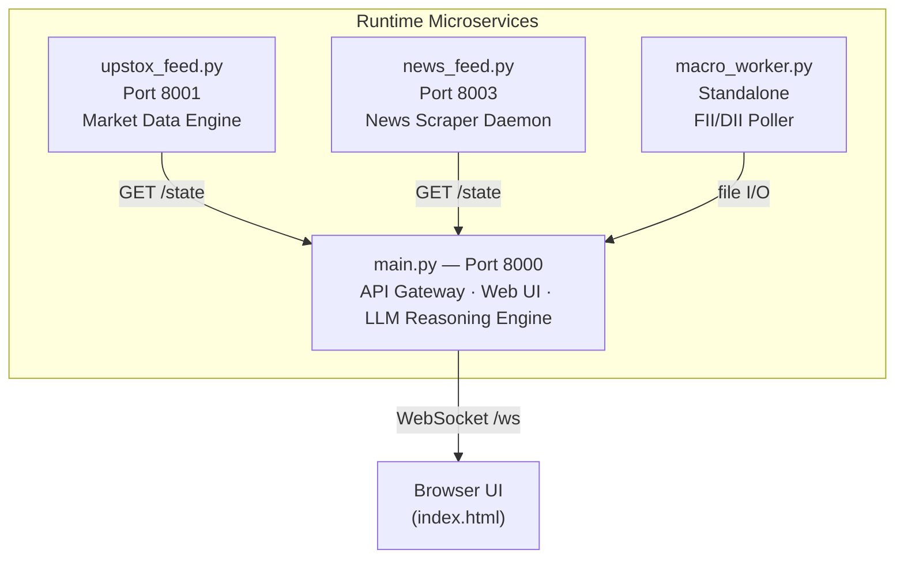

# QuantFlow — Autonomous Algorithmic Trading Copilot

A high-throughput, event-driven algorithmic trading system built on a **4-microservice architecture** that ingests live Indian equities data via **3 multiplexed WebSocket streams**, processes it through a **6-layer deterministic signal pipeline**, and autonomously generates trade execution tickets using **Gemini 2.5 Flash** as a qualitative judge.

Designed from the ground up for **low-latency tick processing**, **O(1) memory-efficient state mutation**, and **zero lock contention** under concurrent load.

---

## System Topology

The system runs as **4 independent Python processes** communicating via **HTTP REST APIs** (inter-service polling) and a **WebSocket** (to the browser UI). Two additional offline scripts handle historical data accumulation.



| Process | Port | Role |
|---|---|---|
| `main.py` | **8000** | API Gateway, Web UI, LLM Reasoning Pipeline |
| `upstox_feed.py` | **8001** | Market Data Feed, Rolling State Engine |
| `news_feed.py` | **8003** | News Scraping, Catalyst Analysis |
| `macro_worker.py` | — | FII/DII Institutional Flow (daily at 18:30 IST) |

---

## Signal Processing Pipeline

The core autonomous trading intelligence pipeline runs every **10 seconds**. It processes raw ticks through 6 deterministic layers before optionally invoking the LLM.

### Layer 1 — Tick Ingestion & Phantom Candle

Raw WebSocket ticks are aggregated into an **O(1) dictionary mutation** (the "Phantom Candle") representing the current unfinished 5-minute bar. On boundary crossing, the phantom is committed to the static DataFrame. This eliminates per-tick storage and keeps the critical path **completely allocation-free**.

### Layer 2 — Multi-Timeframe Technical Analysis

Every 1.5 seconds, the `RollingStateEngine` computes indicators across 6 timeframes (5m → 4h):

| Category | Indicators |
|---|---|
| **Momentum** | RSI, MACD (signal + histogram), CMF |
| **Volatility** | Bollinger Bands, ATR, VWAP |
| **Microstructure** | OBI, CVD, Whale CVD, Session VWAP, Volume Profile (POC/VAH/VAL) |
| **Structure** | Camarilla Pivots (H4/H3/L3/L4), Double Bottom/Top, Head & Shoulders |
| **Candlestick** | TA-Lib patterns (Engulfing, Hammer, Doji, etc.) |
| **Derivatives** | PCR, Max Pain, ATM IV, IV Rank (52W), OI Volume Shock |

### Layer 3 — Semantic Tagging (Dimensionality Reduction)

Raw float telemetry (100+ fields) is compressed into ~15 **institutional semantic states** (e.g., `vol_z > 2.5` → `TIME_ADJUSTED_SHOCK`, flow divergence → `HIDDEN_BULLISH_ABSORPTION`). This prevents the LLM from hallucinating on arbitrary numbers and forces reasoning over categorical market microstructure states.

### Layer 4 — Regime Classification

A **hysteresis-protected finite state machine** classifies market conditions into 5 regimes:

- `TREND_EXPANSION` — Strong directional move
- `PRE_BREAKOUT_SQUEEZE` — Volatility compression before breakout
- `RANGE_BOUND_CHOP` — Sideways consolidation
- `MEAN_REVERSION_IMMINENT` — Overextended, reversal likely
- `TRANSITIONAL_DRIFT` — Indeterminate transition

### Layer 5 — 3-Tier Deterministic Firewall

A token-saving gate that rejects weak signals **before any LLM API call**:

1. **ConvictionScorer** — 13-signal weighted composite → directional bias → execution geometry (entry/stop/target) → expectancy matrix. Weak setups rejected here.
2. **IntradayGatekeeper** — Regime dampening, time-of-day guards, active position management. Further filters passed setups.
3. **Debounce Guard** — Requires 3 consecutive stable ticks before accepting a state change. Prevents whipsaw LLM calls.

### Layer 6 — LLM Qualitative Judge

Only signals that survive all 3 deterministic gates reach **Gemini 2.5 Flash**. The LLM receives the full semantic payload and outputs a structured `execution_ticket`:

- `CONFIRM` — Execute the trade
- `DEFER` — Wait for better entry
- `ADJUST` — Modify parameters
- `ABORT` — Cancel the signal

### Feedback Calibration Loop

Every emitted signal is logged by the **SignalLedger**, which tracks 30-minute and 60-minute directional outcomes. The **PerformanceAnalyzer** computes win rates and profit factor per regime, feeding results back into:

- **ConvictionScorer** adaptive weights (per-regime scaling based on historical accuracy)
- **LLM prompt** (historical calibration block with win rates and profit factor)

---

## Key Architectural Patterns

### Phantom Candle — O(1) Tick Aggregation
Instead of storing every tick, ticks are accumulated into a single dictionary (`phantom_candle`) representing the current unfinished 5-minute bar. On boundary crossing, the phantom is committed to the DataFrame. Technicals are computed by temporarily concatenating the phantom every 1.5s. This keeps memory usage flat regardless of tick volume.

### Single-Writer Concurrency
Four concurrent `asyncio` background tasks coordinate through the single-writer principle. Each piece of shared state has exactly one writer — entirely eliminating lock contention without any mutexes.

### Anti-Cold-Start Hydration
On restart, `RollingStateEngine` hydrates from `cache_state.json` (written every 5 min). If the cache is <24h old, the engine skips the full warmup cycle and restores phantom candles, options state, and daily metrics from disk.

### Tri-Stream WebSocket Multiplexing
Three concurrent WebSocket connections to the Upstox exchange, each in a different mode:
- **Stream 1** (`full`) — Index ticks (Nifty 50, Bank Nifty)
- **Stream 2** (`full_d30`) — Equity ticks (watchlist stocks)
- **Stream 3** (`option_greeks`) — Live option greeks (CE/PE OI, IV)

---

## Project Structure

```
trading_copilot/
├── main.py                    # Entry point — API Gateway & Orchestrator
├── api_server.py              # FastAPI app (25+ endpoints, WebSocket)
├── config.py                  # Environment config (.env loader)
│
├── data_services/             # Independent microservices
│   ├── upstox_feed.py         # Market Data Engine (Port 8001)
│   ├── news_feed.py           # News Scraper Daemon (Port 8003)
│   ├── macro_worker.py        # FII/DII Institutional Flow Tracker
│   └── parquet_engine.py      # Parquet file I/O utilities
│
├── rolling_state_engine.py    # Core state machine — warmup, phantom candle, technicals
├── technical_engine.py        # MathEngine — RSI, MACD, BB, ATR, VWAP, CMF, patterns
├── microstructure_engine.py   # OBI, CVD, Whale CVD, Session VWAP
├── derivatives_engine.py      # BSM IV solver (Newton-Raphson), PCR, Max Pain
├── derivatives_worker.py      # Option chain REST poller (2-min interval)
│
├── semantic_tagger.py         # Float → semantic state dimensionality reduction
├── regime_manager.py          # Hysteresis-protected FSM (5 market regimes)
├── conviction_scorer.py       # 13-signal weighted composite scorer
├── intraday_gatekeeper.py     # Final deterministic sieve (time/regime/debounce)
├── reasoning_engine.py        # Gemini 2.5 Flash LLM integration
│
├── signal_ledger.py           # Signal outcome tracking (JSONL per-day logs)
├── performance_analyzer.py    # Win rate, profit factor, regime accuracy
│
├── screener_engine.py         # Universe screening & ranking
├── mtf_extractor.py           # Multi-timeframe data extraction
├── news_engine.py             # News catalyst analysis (Gemini sentiment)
├── macro_eod_engine.py        # End-of-day macro metrics
├── pipeline_guard.py          # Circuit breaker & safety checks
├── diagnostic_ui.py           # Shared state singleton (TerminalDashboard)
├── history_manager.py         # Trade ledger persistence
├── auth_manager.py            # Upstox OAuth2 PKCE authentication
├── scrip_master_engine.py     # NSE instrument master download
├── warm_layer_engine.py       # Historical warmup data fetcher
├── historical_engine.py       # Nifty baseline + per-symbol LTF/HTF fetch
├── stitching_engine.py        # Data stitching utilities
├── websocket_engine.py        # WebSocket connection management
│
├── scripts/
│   ├── master_bootstrap.py    # EOD derivatives backfill (offline, hours)
│   └── macro_bootstrap.py     # 5-year macro baselines (offline, minutes)
│
├── templates/
│   └── index.html             # Real-time browser dashboard (WebSocket client)
│
├── watchlist.csv              # Active instrument universe
└── master_fno_list.csv        # F&O eligible symbols
```

---

## Launch Sequence

### Prerequisites

```bash
pip install fastapi uvicorn aiohttp pandas numpy pandas_ta scipy google-genai upstox-client pyotp tqdm
```

> **Note**: TA-Lib requires a separate C library installation. See [TA-Lib docs](https://ta-lib.github.io/ta-lib-python/install.html).

### Configuration

Create a `.env` file in the project root:

```env
UPSTOX_API_KEY=your_api_key
UPSTOX_API_SECRET=your_api_secret
UPSTOX_REDIRECT_URI=your_redirect_uri
UPSTOX_PIN=your_pin
UPSTOX_TOTP_KEY=your_totp_secret
GEMINI_API_KEY=your_gemini_api_key
```

### Runtime Services (start in order)

```bash
# Terminal 1 — Market Data Engine (must start first for auth)
python trading_copilot/data_services/upstox_feed.py

# Terminal 2 — FII/DII Daily Tracker
python trading_copilot/data_services/macro_worker.py

# Terminal 3 — News Daemon
python trading_copilot/data_services/news_feed.py

# Terminal 4 — API Gateway & UI (start ~5s after feeds are up)
python trading_copilot/main.py
```

Then open `http://localhost:8000` in your browser.

### Offline Bootstrap (run as needed)

```bash
# Backfill historical derivatives data (takes hours)
python trading_copilot/scripts/master_bootstrap.py

# Test with 2 days + 2 symbols
python trading_copilot/scripts/master_bootstrap.py --dry-run

# Regenerate 5-year macro baselines (takes minutes)
python trading_copilot/scripts/macro_bootstrap.py
```

---

## Tech Stack

| Category | Technology |
|---|---|
| **Language** | Python 3.11+ |
| **Async Runtime** | `asyncio` (single-threaded cooperative multitasking) |
| **Web Framework** | FastAPI + Uvicorn |
| **Inter-Service Comm** | `aiohttp` (async HTTP polling) |
| **Market Data** | Upstox Python SDK (REST + WebSocket) |
| **LLM** | Google Gemini 2.5 Flash (`google-genai`) |
| **Technical Analysis** | `pandas_ta`, `TA-Lib` (C-optimized patterns) |
| **Numerical** | `pandas`, `numpy`, `scipy` |
| **Data Storage** | Parquet (historical), JSON/JSONL (state & signals) |
| **Authentication** | OAuth2 PKCE + TOTP (`pyotp`) |

---

## License

This project is open-source and available under the [MIT License](LICENSE).
