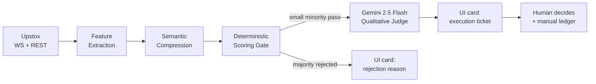
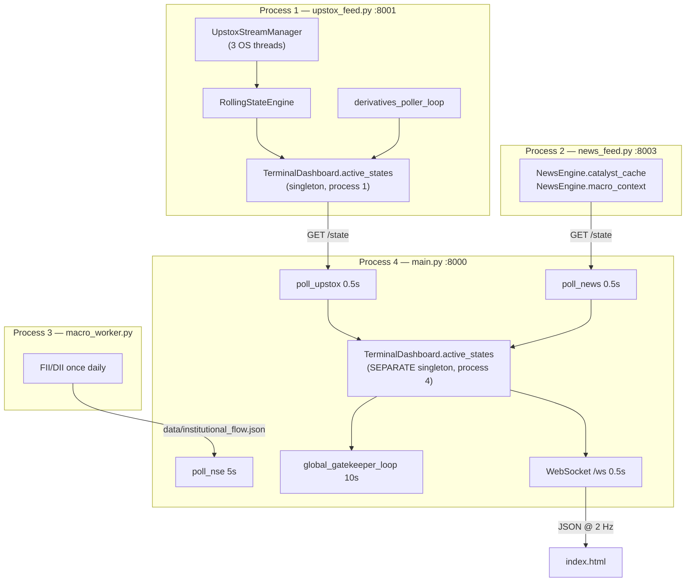

# QuantFlow / AlgoTrade — Detailed Architecture Overview

> **Method**: Derived by reading every source file in `trading_copilot/` (≈10,650 LOC incl. the 2,771-line UI),
> resolving every import into a reverse-dependency index, and executing path-resolution and data-file
> inspection against the actual repo state. Every structural claim carries a `file:line` citation.
> Anything that could not be confirmed without a live market session is marked **[unverified — needs runtime]**.
>
> This document describes the system **as built**, not as advertised. For the gap between the two, see
> [drawbacks_false_claimed.md](drawbacks_false_claimed.md).
>
> Companion docs: [QuantFlow_architecture_summary.md](../../QuantFlow_architecture_summary.md) (author's summary),
> [README.md](../../README.md) (public description).

---

## 0. What this system actually is

A **single-operator, human-in-the-loop intraday research console** for NSE equities.

It is *not* an autonomous trading system: there is no broker order placement anywhere in the codebase.
The terminal output of the pipeline is a **UI card** carrying a suggested Action / Entry / Stop / Target,
plus a manual trade ledger the operator fills in by hand
([api_server.py:412-428](trading_copilot/api_server.py#L412-L428), [history_manager.py](trading_copilot/history_manager.py)).

Its real value proposition is **feature engineering + LLM triage**: it compresses ~120 numeric telemetry
fields into ~15 categorical "semantic states", scores them deterministically, and uses that score as a
*token-budget gate* deciding which of ~27 watchlist symbols are worth a Gemini call.



---

## 1. Process topology (as actually launched)

Four Python processes. **All four are started manually** — there is no supervisor, and
[start_all.bat](trading_copilot/start_all.bat) is stale (it launches `smart_api_feed.py` and `nse_feed.py`;
the latter does not exist in the repo at all).

| # | Process | Port | Bind | Launch order | Lifecycle |
|---|---|---|---|---|---|
| 1 | [`data_services/upstox_feed.py`](trading_copilot/data_services/upstox_feed.py) | 8001 | `127.0.0.1` ([:557](trading_copilot/data_services/upstox_feed.py#L557)) | **first** — owns OAuth | long-running |
| 2 | [`data_services/news_feed.py`](trading_copilot/data_services/news_feed.py) | 8003 | `127.0.0.1` ([:78](trading_copilot/data_services/news_feed.py#L78)) | any time | long-running |
| 3 | [`data_services/macro_worker.py`](trading_copilot/data_services/macro_worker.py) | — | file I/O only | **manual only** ([:108](trading_copilot/data_services/macro_worker.py#L108)) | fetch → sleep to 18:30 IST |
| 4 | [`main.py`](trading_copilot/main.py) → [`api_server.py`](trading_copilot/api_server.py) | 8000 | **`0.0.0.0`** ([:442](trading_copilot/api_server.py#L442)) | last | long-running |

> **Correction to the existing summary.** `macro_worker` is *not* "embedded from `upstox_feed.py`".
> `upstox_feed.py` never imports it. Only [`rolling_state_engine.py:13`](trading_copilot/rolling_state_engine.py#L13)
> imports its `InstitutionalFlowTracker`, and only to call the read-only `load_state()`.
> **If process #3 is never launched by hand, FII/DII is permanently zero.**

### 1.1 Inter-process contract



**Key structural fact.** `TerminalDashboard` ([diagnostic_ui.py:11](trading_copilot/diagnostic_ui.py#L11))
is a *class-attribute singleton*, so it exists **independently in each process**. Process 4's copy is
wholesale replaced every 500 ms at
[api_server.py:47-49](trading_copilot/api_server.py#L47-L49):

```python
local_active_states = data.get("active_states", {})
TerminalDashboard.active_states = local_active_states   # entire dict swapped
```

Consequence: anything written into `active_states` **inside process 4** is destroyed within 500 ms.
The field-preservation logic in `update_state()`
([diagnostic_ui.py:17-30](trading_copilot/diagnostic_ui.py#L17-L30)) only has effect in **process 1**.

### 1.2 Cross-process serialisation cost

Process 1 serialises its entire state (27 symbols × ~120 fields, incl. nested geometry / candlestick /
camarilla dicts) to JSON on every `GET /state`, and process 4 polls **twice per second**
([api_server.py:44,51](trading_copilot/api_server.py#L44-L51)). At roughly 6 KB/symbol that is on the
order of 300 KB/s of JSON encode + decode purely to move data between two processes on one machine.

---

## 2. Data plane — tick to state

### 2.1 Authentication

[`UpstoxAuthenticator`](trading_copilot/data_services/upstox_feed.py#L44-L214)

- Token cache `upstox_token.json`, 24-hour TTL ([:57-69](trading_copilot/data_services/upstox_feed.py#L57-L69)).
- Flow: **standard OAuth2 Authorization Code with client secret** — `client_id`, `client_secret`,
  `grant_type=authorization_code` ([:166-195](trading_copilot/data_services/upstox_feed.py#L166-L195)).
  There is **no PKCE** — no `code_verifier` or `code_challenge` exists anywhere in the repo (verified by grep).
- The Playwright headless path exists ([:98-152](trading_copilot/data_services/upstox_feed.py#L98-L152))
  but is **hard-disabled**: [:205-207](trading_copilot/data_services/upstox_feed.py#L205-L207) sets
  `code = None` unconditionally, commented *"Disabled Playwright headless login since it's too slow/brittle."*
- The only live path is `_manual_fallback()` → **blocking `input()`**
  ([:159](trading_copilot/data_services/upstox_feed.py#L159)). The operator must paste a redirect URL once
  every 24 h. **The system cannot start unattended.**

### 2.2 Tri-stream subscription

[`start_multiplexer`](trading_copilot/data_services/upstox_feed.py#L321-L338) opens three
`MarketDataStreamerV3` connections, each on a plain `threading.Thread` — not daemon, never joined,
never supervised:

| Stream | Mode | Universe |
|---|---|---|
| `stream_macro` | `full` | `NSE_INDEX\|Nifty 50`, `NSE_INDEX\|Nifty Bank` |
| `stream_equity` | `full_d30` | watchlist equities (30-level depth) |
| `stream_options` | `option_greeks` | watchlist NFO entries |

`_on_close` only logs ([:308-309](trading_copilot/data_services/upstox_feed.py#L308-L309)).
**There is no reconnect logic** — a dropped stream silently stops all data for its universe until the
process is restarted.

The options stream is effectively unused: `HistoricalFetcher.upstox_fo_map` is initialised at
[historical_engine.py:116](trading_copilot/historical_engine.py#L116) but **never populated** (only
`upstox_eq_map` is filled, [:117-121](trading_copilot/historical_engine.py#L117-L121)), so an `NFO`
watchlist row falls back to the non-existent key `f"NSE_FO|{sym}"`
([upstox_feed.py:525](trading_copilot/data_services/upstox_feed.py#L525)). The shipped
[watchlist.csv](trading_copilot/watchlist.csv) contains only `NSE` rows, so this is latent rather than active.

### 2.3 Tick callback → phantom candle

[`_on_market_update`](trading_copilot/data_services/upstox_feed.py#L236-L303) runs **on the WebSocket
thread**, not the event loop:

1. **Hard-gates on market hours** ([:239-240](trading_copilot/data_services/upstox_feed.py#L239-L240)) —
   returns immediately outside 09:15–15:30 IST Mon–Fri. No pre-open or post-close data ever enters the system.
2. Flattens the protobuf dict: `ltp`, `vtt` (**cumulative** volume-traded-today), `oi`, `optionGreeks`,
   and the 30-level `bidAskQuote` book.
3. Calls `rolling_engine.process_tick(...)` directly, commented
   *"thread safe because Python dictionary updates are protected by the GIL"*
   ([:289](trading_copilot/data_services/upstox_feed.py#L289)).

[`process_tick`](trading_copilot/rolling_state_engine.py#L141-L239):

```
option greeks?  → update RollingStateEngine.live_options_state[parent]; return    :148-175
token unknown?  → if Nifty 50, poke ltp into active_states; return                :178-183
boundary cross? → commit old phantom to ltf_df via .loc[len(df)] = phantom        :188-196
                  start new phantom {o,h,l,c,volume,oi,microstructure}            :201-211
else            → h/l/c update; phantom['volume'] += volume; oi = oi              :214-218
always          → MicrostructureEngine.generate_microstructure_payload(tick)      :233
```

> **Data-integrity note.** `volume` here is the raw cumulative `vtt`, and
> [:217](trading_copilot/rolling_state_engine.py#L217) *adds* it on every tick.
> `MicrostructureEngine` independently and **correctly** differences it
> ([microstructure_engine.py:142-143](trading_copilot/microstructure_engine.py#L142-L143)).
> The two subsystems therefore disagree about what "volume" means — see
> [drawbacks_false_claimed.md](drawbacks_false_claimed.md) §A-1.

### 2.4 Microstructure engine

[`MicrostructureEngine`](trading_copilot/microstructure_engine.py) — class-level state, keyed per token:

| Field | Method | Definition |
|---|---|---|
| `obi` | [:34-44](trading_copilot/microstructure_engine.py#L34-L44) | `(Σbid_qty − Σask_qty) / (Σbid_qty + Σask_qty)` over all 30 levels |
| `cvd` | [:47-56](trading_copilot/microstructure_engine.py#L47-L56) | tick rule: `+vol` if `ltp ≥ best_ask`, `−vol` if `ltp ≤ best_bid` |
| `session_vwap` | [:59-82](trading_copilot/microstructure_engine.py#L59-L82) | `Σ(p·v)/Σv`, **reset on IST date change** |
| `whale_cvd_live` | [:85-97](trading_copilot/microstructure_engine.py#L85-L97) | CVD restricted to prints where `ltp·vol > max(₹5L, ltp·5000)` |
| `whale_cvd_ema_1h`, `whale_cvd_slope` | [:100-130](trading_copilot/microstructure_engine.py#L100-L130) | 60-sample (1/min) deque; EMA α=2/61; slope = `np.polyfit` over last 15 min |
| `poc_price`, `poc_distance_pct` | [:16-31](trading_copilot/microstructure_engine.py#L16-L31) | volume histogram binned at `int(round(ltp))` — **fixed ₹1 bins** |

**Daily-reset asymmetry** (verified): `session_vwap_state` resets on date change and pops `cvd_state` and
`whale_cvd_state` ([:69-75](trading_copilot/microstructure_engine.py#L69-L75)), but `last_vtt_state`
([:151](trading_copilot/microstructure_engine.py#L151)) and `vol_profile_state`
([:8](trading_copilot/microstructure_engine.py#L8)) are **never reset**.

### 2.5 Historical warm-up

[`fetch_batch_warmups`](trading_copilot/historical_engine.py#L101-L150), run once at process-1 boot:

1. Nifty 50 daily × 100 d → `HistoricalFetcher.nifty_baseline_df` (class attribute, **never refreshed**).
2. Download the Upstox instrument master (`complete.csv.gz`, cached daily,
   [scrip_master_engine.py:16-46](trading_copilot/scrip_master_engine.py#L16-L46)).
3. Per symbol, **sequentially** with 1 s sleeps: 1-minute candles × 30 d resampled to 5 min
   ([:68-77](trading_copilot/historical_engine.py#L68-L77)) → `ltf_df`; daily × 100 d → `htf_df`.

Cost: 27 symbols × 2 calls × (1 s sleep + latency) ≈ **90–150 s of cold start** before any technicals exist.

### 2.6 Anti-cold-start hydration

[`_hydrate_from_cache`](trading_copilot/rolling_state_engine.py#L74-L112) restores `phantom_candles`,
`live_options_state`, `daily_metrics_cache` and both DataFrames from `data/cache_state.json` when it is
**< 24 h old**. Written every 5 min by
[`state_persistence_worker`](trading_copilot/data_services/upstox_feed.py#L549-L555).

Current on-disk size: **6.29 MB**, serialised synchronously with `json.dump` on the event loop
([:68-69](trading_copilot/rolling_state_engine.py#L68-L69)). The 24 h window is wall-clock, not
session-aware — a Saturday-morning restart hydrates Friday afternoon's intraday phantom candles as current.

---

## 3. Analytics layer

### 3.1 The 1.5-second calculation loop

[`calculate_technicals_loop`](trading_copilot/rolling_state_engine.py#L241-L426) is the computational core.
**Exactly one `await` exists, after the whole batch**
([:426](trading_copilot/rolling_state_engine.py#L426)) — all 27 symbols are processed synchronously inside
one iteration, so process 1's event loop (and its `/state` endpoint) is blocked for the batch duration.

Per symbol, per iteration:

| Step | Code | Work |
|---|---|---|
| Phantom merge | [:259-261](trading_copilot/rolling_state_engine.py#L259-L261) | `pd.concat([ltf_df, phantom])` — full copy of ~1,650 rows |
| Technicals | [:284-289](trading_copilot/rolling_state_engine.py#L284-L289) | `MathEngine.generate_signal_payload` (§3.2) |
| Baselines | [:316-320](trading_copilot/rolling_state_engine.py#L316-L320) | **re-opens and re-parses `macro_baselines.json` (20 KB) from disk** |
| FII/DII | [:370](trading_copilot/rolling_state_engine.py#L370) | **re-opens and re-parses `institutional_flow.json`** |
| Volume profile | [:358](trading_copilot/rolling_state_engine.py#L358) | 100-bin profile via a Python `for` loop over all rows |
| Breadth | [:373-379](trading_copilot/rolling_state_engine.py#L373-L379) | A/D computed over the 27-symbol watchlist |
| Confluence | [:397-417](trading_copilot/rolling_state_engine.py#L397-L417) | hardcoded `high_probability_setup` boolean |
| Publish | [:421](trading_copilot/rolling_state_engine.py#L421) | `TerminalDashboard.update_state(token, payload)` |

The entire per-symbol body sits inside **one** `try` at
[:248](trading_copilot/rolling_state_engine.py#L248) whose `except` is *outside* the `for` loop
([:423](trading_copilot/rolling_state_engine.py#L423)) — an exception on symbol *k* aborts symbols
*k+1…n* for that cycle.

### 3.2 MathEngine

[`generate_signal_payload`](trading_copilot/technical_engine.py#L476-L548) recomputes **everything from
scratch over full history** on each call, then keeps only `.iloc[-1]`:

| Function | Line | Output | Note |
|---|---|---|---|
| `calc_trend_and_momentum` | [:9](trading_copilot/technical_engine.py#L9) | EMA 9/21, RSI 14, MACD 12/26/9, BB 20/2, ATR 14 | NaN-filled without `bfill` (deliberate, [:41](trading_copilot/technical_engine.py#L41)) |
| `calc_institutional_volume` | [:64](trading_copilot/technical_engine.py#L64) | VWAP + bands, **time-of-day volume z-score**, CMF 20 | z-score via `df.apply(axis=1)` over ~1,650 rows ([:104](trading_copilot/technical_engine.py#L104)) |
| `calc_macro_geometry` | [:121](trading_copilot/technical_engine.py#L121) | double top/bottom, H&S, inverse H&S | `argrelextrema(order=5)` on **closes**; 0.2 % / 1 % equality tolerance |
| `calc_micro_candlesticks` | [:182](trading_copilot/technical_engine.py#L182) | TA-Lib engulfing, hammer, shooting star, morning/evening star, doji | last bar only |
| `calc_camarilla_pivots` | [:219](trading_copilot/technical_engine.py#L219) | H4/H3/L3/L4 from `htf_df.iloc[-2]` | |
| `calc_htf_trend` | [:243](trading_copilot/technical_engine.py#L243) | Bullish/Bearish vs daily EMA-9 | uses `bfill` here, contradicting [:41](trading_copilot/technical_engine.py#L41) |
| `calc_relative_strength` | [:267](trading_copilot/technical_engine.py#L267) | 50-day return spread vs Nifty | |
| `calc_alpha_5d` | [:286](trading_copilot/technical_engine.py#L286) | 5-day return spread vs Nifty | |
| `calc_volume_profile_high_fidelity` | [:305](trading_copilot/technical_engine.py#L305) | POC + VAH/VAL via **contiguous 70 % expansion** ([:365-377](trading_copilot/technical_engine.py#L365-L377)) | algorithm correct; keys named `rolling_20d_*` but computed on the **30-day** `ltf_df` |
| `generate_omni_dataframes` / `calc_omni_metrics` | [:389](trading_copilot/technical_engine.py#L389) | RSI/EMA/MACD/ATR/BB at 5m, 15m, 30m, 1h, 4h | `df.resample('1h'/'4h')` is **midnight-anchored**, not session-anchored |

Keys are flattened as `{metric}_{tf}` ([:529-531](trading_copilot/technical_engine.py#L529-L531)) —
`rsi_15m`, `atr_1h`, `bb_upper_4h`, … — plus a `_1d` block from `htf_df`
([:534-546](trading_copilot/technical_engine.py#L534-L546)).

### 3.3 Derivatives sub-pipeline

Two independent implementations exist; only one runs.

**Live** — [`derivatives_poller_loop`](trading_copilot/derivatives_worker.py#L197-L287), an asyncio task in
process 1. Per symbol it makes **4 sequential Upstox REST calls** plus a 1 s sleep
([:252-276](trading_copilot/derivatives_worker.py#L252-L276)):

1. `get_option_contracts` → nearest expiry
2. `get_pcr_data` → PCR
3. `get_max_pain_data` → max pain
4. `get_full_market_quote` on the ATM **call only** → premium → `calc_bsm_iv`
   ([:84-105](trading_copilot/derivatives_worker.py#L84-L105)) → ATM IV
5. `calculate_ivr` ([:50-82](trading_copilot/derivatives_worker.py#L50-L82)) → IV Rank

Results are written into `TerminalDashboard.active_states[state_key]`
([:263-267](trading_copilot/derivatives_worker.py#L263-L267)) and preserved across recomputation by
[diagnostic_ui.py:20-28](trading_copilot/diagnostic_ui.py#L20-L28).

With 29 targets × (4 calls + 1 s) the loop takes **well over 2 minutes**, so the trailing
`await asyncio.sleep(120)` ([:288](trading_copilot/derivatives_worker.py#L288)) puts the real cadence at
roughly 4–6 min, not the documented 2 min. **[unverified — needs runtime]** for exact latency.

**Legacy (dead)** — [`derivatives_engine.OptionsAnalyzer`](trading_copilot/derivatives_engine.py#L61-L288),
Angel One SmartAPI based. `start_polling` is **never called** (verified by grep) and it depends on
[`get_option_chain_tokens`](trading_copilot/scrip_master_engine.py#L172-L173), a stub returning `[]`.
Its class defaults (`macro_state = {"pcr": 1.0, …}`) are therefore permanent. Only its
`implied_volatility()` is live, imported by
[master_bootstrap.py:18](trading_copilot/scripts/master_bootstrap.py#L18).

**Streamed** — `option_greeks` ticks maintain `RollingStateEngine.live_options_state[parent]`
(CE/PE OI, live PCR, IV) at
[rolling_state_engine.py:148-175](trading_copilot/rolling_state_engine.py#L148-L175).
This dict is written and cached but **never read** by any downstream consumer.

### 3.4 News pipeline

[`NewsEngine`](trading_copilot/news_engine.py) in process 2:

| Loop | Interval | Path |
|---|---|---|
| `_news_polling_loop` | 120 s ([:240-248](trading_copilot/news_engine.py#L240-L248)) | one batched `get_news(instrument_keys=…)` for the whole watchlist → up to 3 headlines/symbol, 96-hour freshness window → `catalyst_cache[sym]["raw_news"]` |
| `_macro_news_polling_loop` | 1800 s ([:360-368](trading_copilot/news_engine.py#L360-L368)) | 10 hardcoded heavyweight proxies ([:313](trading_copilot/news_engine.py#L313)) → Gemini → `{sentiment, summary}` → `macro_context` |

The macro loop is content-hash de-duplicated to avoid redundant LLM calls
([:342-345](trading_copilot/news_engine.py#L342-L345)) — a genuinely good touch.

Per-symbol Gemini sentiment (`analyze_catalyst`, [:44-65](trading_copilot/news_engine.py#L44-L65)) is
**defined but never called**. Symbol-level news reaches the LLM as raw headlines only.

### 3.5 Institutional flow

[`macro_poller_loop`](trading_copilot/data_services/macro_worker.py#L48-L106) — Upstox `get_fii_data` /
`get_dii_data` on `NSE_EQ|CASH`, net = buy − sell, written to `data/institutional_flow.json` as
`{timestamp, fii_net, dii_net, ad_ratio}` ([:27-34](trading_copilot/data_services/macro_worker.py#L27-L34)).

The written schema has **no `date` key**, but [api_server.py:341](trading_copilot/api_server.py#L341)
reads `.get('date', …)` — so the UI's macro date always shows the fallback.

A second, older tracker — [`macro_eod_engine.InstitutionalFlowTracker`](trading_copilot/macro_eod_engine.py) —
scrapes `nseindia.com` directly (with a `sleep(3)` labelled *"Required to bypass Akamai anti-bot
protection"*, [:109](trading_copilot/macro_eod_engine.py#L109)). Its `start_daily_cron` is never called;
it is imported once as `LegacyTracker`
([rolling_state_engine.py:11](trading_copilot/rolling_state_engine.py#L11)) and never used.

---

## 4. Decision chain

The chain is entered through [`build_structured_payload`](trading_copilot/reasoning_engine.py#L57-L119),
which is called from **two independent places**:

| Caller | Rate | Purpose |
|---|---|---|
| [api_server.py:370](trading_copilot/api_server.py#L370) (WebSocket loop) | **2 Hz × every symbol** | embed `structured_payload` in the UI frame |
| [reasoning_engine.py:451](trading_copilot/reasoning_engine.py#L451) (gatekeeper loop) | 0.1 Hz × every symbol | drive the actual decision |

Both resolve the **same per-symbol `RegimeManager` and `ConvictionScorer` singletons**
([regime_manager.py:147-154](trading_copilot/regime_manager.py#L147-L154),
[conviction_scorer.py:311-318](trading_copilot/conviction_scorer.py#L311-L318)) and both **mutate** them —
see [drawbacks_false_claimed.md](drawbacks_false_claimed.md) §A-3.

### 4.1 Stage 1 — SemanticTagger

[`translate_to_llm_payload`](trading_copilot/semantic_tagger.py#L10-L238): flat floats → 4 categorical blocks.

**Market-closed guard** ([:19-24](trading_copilot/semantic_tagger.py#L19-L24)) zeroes `whale_cvd_live`,
`vol_z_score_5m`, `obi`, `price_to_vwap_pct`, `whale_cvd_slope`; geometry/candlesticks/camarilla still pass through.

| Block | Field | Rule | Source |
|---|---|---|---|
| **1 micro** | `session_cost_basis_state` | `price_to_vwap_pct / atr_pct_15m` → ±0.75 / ±1.5 bands | [:54-64](trading_copilot/semantic_tagger.py#L54-L64) |
| | `flow_divergence_state` | sign(VWAP dev) × sign(whale slope), gated on `abs(slope) > 50` | [:67-79](trading_copilot/semantic_tagger.py#L67-L79) |
| | `volume_regime` | `vol_z` > 2.5 / > 1.0 / < −1.0 | [:82-89](trading_copilot/semantic_tagger.py#L82-L89) |
| | `order_book_imbalance_state` | `obi` ±0.2 / ±0.6 | [:92-101](trading_copilot/semantic_tagger.py#L92-L101) |
| | `fractal_alignment`, `elasticity_risk`, `kinetic_divergence`, `volatility_state` | **pass-through from flat payload** | [:108-111](trading_copilot/semantic_tagger.py#L108-L111) |
| **2 derivatives** | `volatility_regime_state` | `iv_percentile_52w` > 90 / > 75 / < 25 | [:118-129](trading_copilot/semantic_tagger.py#L118-L129) |
| | `options_gravity_state` | `abs(ltp − max_pain) / atr_1d` < 0.3 / > 2.0 | [:131-142](trading_copilot/semantic_tagger.py#L131-L142) |
| | `pcr_regime` | `pcr_percentile_52w` > 80 / < 20 | [:144-153](trading_copilot/semantic_tagger.py#L144-L153) |
| **3 structure** | `structural_proximity_state` | nearest of POC/VAH/VAL; `TEST_IMMINENT` < 0.5·ATR₁ᴅ | [:165-191](trading_copilot/semantic_tagger.py#L165-L191) |
| | `momentum_confluence` | `alpha_vs_nifty_5d` ±0.5 / ±2.0 | [:193-208](trading_copilot/semantic_tagger.py#L193-L208) |
| | `key_geometry`, `candlestick_patterns`, `camarilla_pivots` | pass-through | [:213-215](trading_copilot/semantic_tagger.py#L213-L215) |
| **4 catalyst** | `raw_news` | pass-through | [:234](trading_copilot/semantic_tagger.py#L234) |

> The four "pass-through" fields in Block 1 originate in
> [`MTFFeatureExtractor.extract_all`](trading_copilot/mtf_extractor.py#L100-L107) — **but nothing calls it.**
> Verified by grep: only `sanitize_for_json` is imported from `mtf_extractor`
> ([reasoning_engine.py:59](trading_copilot/reasoning_engine.py#L59)). So `fractal_alignment`,
> `elasticity_risk`, `kinetic_divergence` and `volatility_state` **always take their `.get()` defaults**
> — `CONFLICTING_CHOP`, `EQUILIBRIUM`, `MOMENTUM_CONFIRMED`, `NORMAL_RANGING`.

Note also: the live `stock_pcr`, `atm_iv` and `ivr` from `derivatives_worker` are **not** placed in
Block 2 — only the *static* 52-week percentiles from `macro_baselines.json` are.

### 4.2 Stage 2 — RegimeManager

[`determine_regime`](trading_copilot/regime_manager.py#L100-L144); priority cascade
([:66-98](trading_copilot/regime_manager.py#L66-L98)):

```
1. volatility_state contains "SQUEEZE"                          → PRE_BREAKOUT_SQUEEZE
2. elasticity "OVERSTRETCHED" and not escape velocity           → MEAN_REVERSION_IMMINENT
3. flow "MOMENTUM_CONFIRMED" and (elevated volume | strong fractal) → TREND_EXPANSION
4. flow "EQUILIBRIUM" | fractal chop, and low volume            → RANGE_BOUND_CHOP
5. otherwise                                                    → TRANSITIONAL_DRIFT
```

Because of the dead `MTFFeatureExtractor` (§4.1), rules 1 and 2 can **never** fire, and rule 3's fractal
branch can never fire. The reachable regime set collapses to
`{TREND_EXPANSION (volume branch only), RANGE_BOUND_CHOP, TRANSITIONAL_DRIFT, MARKET_CLOSED}`.

Hysteresis ([:123-128](trading_copilot/regime_manager.py#L123-L128)): a regime change requires
**2 of the last 3** snapshots to agree — not 3 consecutive.
`SessionMemory.buffer` is `deque(maxlen=12)` ([:9](trading_copilot/regime_manager.py#L9)).

Session phases ([:44-64](trading_copilot/regime_manager.py#L44-L64)): `OPENING_RANGE` (<09:45),
`MORNING_SESSION` (<12:00), `LUNCH_CHOP` (<13:00), `POWER_HOUR` (<15:00), `CLOSE_AUCTION`.

### 4.3 Stage 3 — ConvictionScorer

[`score_setup`](trading_copilot/conviction_scorer.py#L42-L299).

| Category | Signals read | Raw range | Divisor | Line |
|---|---|---|---|---|
| micro | flow_div ±3, obi ±1, cost_basis ±1, fractal ±2, kinetic ±1, elasticity ±2; ×1.5 on volume shock | ±10 | 5.0 | [:64-95](trading_copilot/conviction_scorer.py#L64-L95) |
| derivatives | pcr_regime ±2, gravity ±1 | ±3 | 3.0 | [:103-110](trading_copilot/conviction_scorer.py#L103-L110) |
| structural | momentum ±2, proximity ±2 | ±4 | 3.0 | [:120-136](trading_copilot/conviction_scorer.py#L120-L136) |
| catalyst | — | **hardcoded 0.0** | — | [:141](trading_copilot/conviction_scorer.py#L141) |

Weights are regime-keyed ([:7-14](trading_copilot/conviction_scorer.py#L7-L14)) and optionally scaled by
historical win rate ([:18-40](trading_copilot/conviction_scorer.py#L18-L40)) once ≥30 signals and ≥10 per
regime exist.

```
composite = micro·w_micro + struct·w_struct + deriv·w_deriv + 0.0·w_cat
bias      = LONG if composite ≥ 0.15 ; SHORT if ≤ −0.15 ; else NEUTRAL → reject
```

**Whipsaw shield** ([:156-165](trading_copilot/conviction_scorer.py#L156-L165)): after 3 polarity flips the
composite is halved once and the counter resets.

**Execution geometry** ([:190-263](trading_copilot/conviction_scorer.py#L190-L263)):

- Level set = session VWAP, 20 d POC/VAH/VAL, Camarilla H3/H4/L3/L4.
- Target = nearest opposing level (2nd-nearest in TREND/SQUEEZE), floored at 1.5·ATR₁₅ₘ.
- Entry = `ltp ∓ 0.2·ATR₅ₘ`.
- Stop = nearest supporting level ∓ `atr_mult·ATR₁₅ₘ`, `atr_mult ∈ {0.30, 0.50, 0.75, 1.00}` by IV regime.
- Slippage buffer `±0.1·ATR₅ₘ` applied to both risk and reward.

**Expectancy matrix** ([:265-279](trading_copilot/conviction_scorer.py#L265-L279)):

```
p_implied   = 0.50 + 0.85·(sigmoid(4.5·abs(composite)) − 0.50)
p_breakeven = eff_risk / (eff_risk + eff_reward)
stat_edge   = p_implied − p_breakeven          → reject if < 0.05
```

### 4.4 Stage 4 — IntradayGatekeeper

[`evaluate`](trading_copilot/intraday_gatekeeper.py#L32-L177); stateless, branches on position presence.

Guards: market closed → `Wait`, no LLM ([:35-38](trading_copilot/intraday_gatekeeper.py#L35-L38));
after 15:20 IST → forced `Close` ([:49-51](trading_copilot/intraday_gatekeeper.py#L49-L51)).

**Path A — position held** ([:70-127](trading_copilot/intraday_gatekeeper.py#L70-L127)):

| Condition | Result |
|---|---|
| stop within 0.5 % **and** semantic absorption/distribution agrees with direction | `Hold`, no LLM (whipsaw filter) |
| stop within 0.5 % **or** `whale_cvd_ema_1h` sign opposes direction | `Close`, **LLM authorised** |
| > 45 min in trade and PnL ∈ [−0.5 %, +0.1 %] | `Wait`, LLM authorised ("failure to launch") |
| > 30 min and drift < 0.2 % | `Hold`, no LLM (stagnation) |
| default | `Hold`, no LLM |

**Path B — flat** ([:129-177](trading_copilot/intraday_gatekeeper.py#L129-L177)):

```
setup_rejected                        → no LLM, surface rejection_reason
effective = composite × { 0.85 | 0.65 in LUNCH_CHOP ; 0.6 in CHOP ; 0.7 in DRIFT }
effective ≥ 0.15 AND stat_edge ≥ 0.05 → LLM AUTHORISED
otherwise                             → no LLM, "REGIME_DAMPENED_<phase>"
```

### 4.5 Stage 5 — Debounce & dispatch

[`start_global_gatekeeper_loop`](trading_copilot/reasoning_engine.py#L424-L529), 10 s cadence.

The **debounce** ([:468-477](trading_copilot/reasoning_engine.py#L468-L477)) is correctly implemented: the
tuple `{action, llm_authorized, has_position}` must repeat for **3 consecutive 10-second ticks** (≈30 s)
before anything is emitted. A further check ([:482](trading_copilot/reasoning_engine.py#L482)) requires the
advice to differ from the last emitted advice, so a stable state fires the LLM once, not repeatedly.

Dispatch needs **both** `llm_authorized` (deterministic) **and** `llm_enabled[symbol]` (operator toggle,
[:486](trading_copilot/reasoning_engine.py#L486)). Authorised-but-toggled-off is surfaced as
`REQUIRED LLM ANALYZE` ([:513](trading_copilot/reasoning_engine.py#L513)). A per-symbol in-flight lock
(`active_loops`) prevents duplicate concurrent calls
([:495-508](trading_copilot/reasoning_engine.py#L495-L508)).

### 4.6 Stage 6 — LLM judge

[`analyze_stock`](trading_copilot/reasoning_engine.py#L122-L420).

- Concurrency cap `asyncio.Semaphore(15)` ([:16](trading_copilot/reasoning_engine.py#L16)).
- Second math firewall before spending a token ([:143-163](trading_copilot/reasoning_engine.py#L143-L163)).
- Prompt: ~2,000-token system instruction ([:182-263](trading_copilot/reasoning_engine.py#L182-L263)) casting
  the model as *"Layer 2 Qualitative Judge"* — 6 numbered directives, per-block attention weighting keyed to
  the active regime, explicit adjustment bounds, null-safety rules.
- Optional historical-calibration block injected once ≥20 resolved signals exist
  ([:270-287](trading_copilot/reasoning_engine.py#L270-L287)).
- Payload minified with `separators=(',',':')` ([:179](trading_copilot/reasoning_engine.py#L179)).
- **Three-tier response repair**: direct `json.loads` → outermost-brace regex extraction → targeted repair of
  unescaped quotes inside `institutional_rationale`
  ([:306-330](trading_copilot/reasoning_engine.py#L306-L330)). Well-engineered.
- Output contract:

```json
{"execution_ticket":{
  "verdict":"CONFIRM|DEFER|ABORT|ADJUST",
  "action_directive":"EXECUTE_LONG|EXECUTE_SHORT|PASS|CLOSE_EXISTING|REVERSE_POSITION",
  "conviction_modifier":0.0,
  "urgency":"IMMEDIATE|LIMIT_ONLY|WAIT_FOR_PULLBACK",
  "regime_echo":"...",
  "institutional_rationale":"...",
  "risk_parameters":{"final_entry":0.0,"final_stop":0.0,"final_target":0.0}}}
```

- `decision_history` — `deque(maxlen=5)` of prior verdicts, fed back into the next prompt as Block 6
  ([:370-378](trading_copilot/reasoning_engine.py#L370-L378), consumed at
  [:221-224](trading_copilot/reasoning_engine.py#L221-L224)). Sound anti-whipsaw design.

### 4.7 Stage 7 — Feedback loop

[`SignalLedger`](trading_copilot/signal_ledger.py) records only **autonomous** signals whose verdict is
`CONFIRM|ADJUST` with an actionable directive
([reasoning_engine.py:380-391](trading_copilot/reasoning_engine.py#L380-L391)).

`start_outcome_resolver` ([:76-162](trading_copilot/signal_ledger.py#L76-L162)) polls at 60 s and marks
`hit_stop` / `hit_target` by comparing the sampled LTP to recorded levels, then `pnl_30m_pct` /
`pnl_60m_pct` and `directional_correct_*` at T+30 / T+60 min, reaching terminal status `RESOLVED` or
`RESOLVED_EARLY`.

Storage: append-only JSONL at `data/signals/signal_log_YYYY-MM-DD.jsonl`; the full record is re-appended on
each update and de-duplicated on read by `signal_id`
([:173-183](trading_copilot/signal_ledger.py#L173-L183)).

[`PerformanceAnalyzer`](trading_copilot/performance_analyzer.py) computes win rate (30 m / 60 m), profit
factor, stop/target hit rates — overall, per regime, per symbol — and `get_feedback_payload` feeds back
into both the ConvictionScorer weights ([conviction_scorer.py:20](trading_copilot/conviction_scorer.py#L20))
and the LLM prompt ([reasoning_engine.py:273](trading_copilot/reasoning_engine.py#L273)).
The loop is genuinely closed.

---

## 5. Offline bootstrap & data model

### 5.1 `master_bootstrap.py` — EOD derivatives backfill

[scripts/master_bootstrap.py](trading_copilot/scripts/master_bootstrap.py), 535 lines, contract-centric:

1. Derive the trading-day calendar from Nifty daily candles
   ([:68-85](trading_copilot/scripts/master_bootstrap.py#L68-L85)).
2. Per symbol, enumerate **expired** option expiries and contracts via `/v2/expired-instruments/*`
   ([:87-92](trading_copilot/scripts/master_bootstrap.py#L87-L92)).
3. Download daily candles for every contract
   ([:94-106](trading_copilot/scripts/master_bootstrap.py#L94-L106)).
4. Per trading day, on the then-active expiry, compute
   ([:255-337](trading_copilot/scripts/master_bootstrap.py#L255-L337)):
   - `EOD_PCR` = ΣPE OI / ΣCE OI, `Total_OI` = ΣCE + ΣPE
   - `EOD_MAX_PAIN` — full OI-weighted intrinsic-loss minimisation across all strikes
   - `EOD_IV` — Newton-Raphson BSM at the max-pain strike, averaging CE and PE, with nearest-strike
     interpolation fallback ([:311-330](trading_copilot/scripts/master_bootstrap.py#L311-L330))
5. Write back into `{SYMBOL}_1D.parquet`, normalising legacy lowercase columns
   ([:108-152](trading_copilot/scripts/master_bootstrap.py#L108-L152)).

Rate limiting ([:20-42](trading_copilot/scripts/master_bootstrap.py#L20-L42)): 0.12 s inter-request
(≈8.3 rps), **1805-second hard cooldown** on any HTTP 429, `os._exit(1)` on 401.

This is the most rigorous module in the codebase. **Verified against live data**: `RELIANCE_1D.parquet`
carries 265 contiguous non-zero `EOD_IV` rows and `df.tail(252)` is **252/252 populated** — the downstream
52-week statistics are computed on genuine data, not padding.

### 5.2 `macro_bootstrap.py` — baselines

[scripts/macro_bootstrap.py](trading_copilot/scripts/macro_bootstrap.py) → `data/macro_baselines.json`
(30 symbols on disk; 24 with full derivatives coverage).

| Group | Metrics | Method |
|---|---|---|
| `volatility_edge_52w` | `iv_percentile_52w`, `iv_52w_high/low`, `historical_vol_20d` | `percentileofscore(kind='weak')` over `tail(252)`; HV = `std(log returns)·√252·100` ([:104-118](trading_copilot/scripts/macro_bootstrap.py#L104-L118)) |
| `options_positioning_52w` | `pcr_percentile_52w`, `oi_volume_shock_52w_z`, `drift_20d_strike_migration` | percentile; OI z-score; 20-day % change in max-pain strike ([:60-93](trading_copilot/scripts/macro_bootstrap.py#L60-L93)) |
| `structural_liquidity_5y` | `volume_poc_price`, `value_area_high/low`, `step_size_used` | daily-close volume histogram, price-tiered bins ₹0.50 / ₹1 / ₹5 ([:122-166](trading_copilot/scripts/macro_bootstrap.py#L122-L166)) |
| `regime_confluence_5y` | `macro_trend_alignment`, `beta_5y`, `alpha_5y` | SMA 50/200 stack; CAPM β from covariance; simplified α ([:170-224](trading_copilot/scripts/macro_bootstrap.py#L170-L224)) |

### 5.3 Parquet schema (verified on disk)

```
Date(datetime) | Open | High | Low | Close | Volume | EOD_IV | EOD_PCR | EOD_MAX_PAIN | Total_OI
```

| File | Rows | Span | EOD coverage |
|---|---|---|---|
| `RELIANCE_1D` | 1,023 | 2022-05-02 → 2026-06-16 | 265 (tail-252 complete) |
| `SAIL_1D` | 1,033 | 2022-04-18 → 2026-06-16 | 259 (4 internal gaps) |
| `NIFTY50_1D` | 1,355 | 2020-12-17 → **2026-06-08** | n/a — **different schema** (`OI`, no EOD columns) |
| `DIACABS_1D` | **1** | 2026-05-25 | 0 — degenerate file |

Two writers produce **incompatible schemas**:
[`parquet_engine._sync_symbol_sync`](trading_copilot/data_services/parquet_engine.py#L88-L176) writes
capitalised `Date/Open/…`, while
[`historical_engine.fetch_and_save_parquet_batch`](trading_copilot/historical_engine.py#L152-L178) writes
lowercase `timestamp/open/…`. Only `master_bootstrap.update_parquet` normalises on write
([:118-127](trading_copilot/scripts/master_bootstrap.py#L118-L127)).

---

## 6. UI architecture

A single 174 KB file, [templates/index.html](trading_copilot/templates/index.html) — Tailwind via CDN,
no build step, no framework, ~40 top-level functions.

### 6.1 Transport

```js
const SERVER_IP = '192.168.29.123:8000';       // :609  hardcoded LAN address
const wsProtocol = ... 'wss://' : 'ws://';     // :614  computed...
const wsUri = `ws://${wsHost}/ws`;             // :615  ...and never used — always ws://
```

`socket.onmessage` ([:629](trading_copilot/templates/index.html#L629)) receives at 2 Hz and drives a full
re-render. `onclose` reconnects on a flat 3 s timer ([:704](trading_copilot/templates/index.html#L704)).

Frame shape ([api_server.py:377-382](trading_copilot/api_server.py#L377-L382)):

```json
{ "global_market_context": {},
  "dashboard_intraday_plays": {},
  "global_state": { "SYMBOL": { "...flat telemetry...": 0, "structured_payload": {} } },
  "macro_state": { "pcr": 0, "fii_net": 0, "dii_net": 0, "date": "", "ad_ratio": 0 } }
```

### 6.2 Tabs and panels

| Tab | Contents |
|---|---|
| **Dashboard** | Macro weather (PCR / FII / DII / net direction / breadth / global sentiment), news control strip, market matrix table |
| **Live Action** | Auto-generated action cards, global auto-analyze toggle, LLM trigger counter |
| **Screener** | Discovery Engine trigger + playbook cards |
| **Per-symbol modal** | 3 sub-tabs — *Reasoning* (LLM card + intent injector), *Catalyst* (raw news), *Telemetry* (raw `structured_payload` JSON) |
| Modals | Settings (system-prompt editor), Position editor, Watchlist editor, Trade-ledger dialogs, Alert tray |

### 6.3 Endpoint binding matrix

| UI call | Backend | Status |
|---|---|---|
| `WS /ws` | [api_server.py:327](trading_copilot/api_server.py#L327) | OK |
| `POST /api/reasoning/instant/{sym}` | [:185](trading_copilot/api_server.py#L185) | OK |
| `POST /api/reasoning/loop/start` \| `stop` | [:191](trading_copilot/api_server.py#L191), [:200](trading_copilot/api_server.py#L200) | **`interval` accepted and ignored** |
| `GET /api/reasoning/report/{sym}`, `all_reports` | [:220](trading_copilot/api_server.py#L220), [:213](trading_copilot/api_server.py#L213) | OK |
| `POST /api/reasoning/position/save`, `sync_all` | [:145](trading_copilot/api_server.py#L145), [:154](trading_copilot/api_server.py#L154) | OK |
| `POST /api/reasoning/playbook/generate` | [:230](trading_copilot/api_server.py#L230) | can hard-block the event loop (drawbacks §A-6) |
| `GET/POST /api/watchlist`, `/add`, `/api/search-token` | [:267](trading_copilot/api_server.py#L267)–[:313](trading_copilot/api_server.py#L313) | OK |
| `POST /api/news/*`, `GET /api/news/state` | [:236](trading_copilot/api_server.py#L236)–[:249](trading_copilot/api_server.py#L249) | OK, proxied to 8003 |
| `POST /api/ledger/open` \| `manage` \| `close` | [:412](trading_copilot/api_server.py#L412)–[:428](trading_copilot/api_server.py#L428) | OK |
| `POST /api/admin/sync-parquet` | [:254](trading_copilot/api_server.py#L254) | OK |
| `POST /api/run-screener` | [:118](trading_copilot/api_server.py#L118) → 8001 [:465](trading_copilot/data_services/upstox_feed.py#L465) | scans all F&O; likely exceeds the 300 s proxy timeout |
| `POST /api/map-option-tokens` | [:121](trading_copilot/api_server.py#L121) → 8001 | **no such route on 8001** — always errors |
| `GET /api/alerts/unread` | — | **route does not exist** |
| `GET /api/alerts/history` | — | **route does not exist** |
| `POST /api/alerts/mark-read/{id}` | — | **route does not exist** |
| — | `GET /api/performance/dashboard` \| `regime` \| `symbols` [:161-183](trading_copilot/api_server.py#L161-L183) | implemented, **no UI consumer** |

### 6.4 Client-side state

`localStorage` keys: `user_positions` (19 references), `llm_system_prompt` (10),
`global_auto_analyze`, `global_analyze_interval`.

Positions are **browser-owned**, pushed to the server via `position/save` / `position/sync_all`.
They therefore do not survive clearing browser data, and a second browser sees a different portfolio.

---

## 7. Persistent state map

| Path | Writer | Reader | Notes |
|---|---|---|---|
| `trading_copilot/watchlist.csv` | api_server [:272](trading_copilot/api_server.py#L272) | all processes | 27 NSE equities |
| `trading_copilot/upstox_token.json` | UpstoxAuthenticator [:186](trading_copilot/data_services/upstox_feed.py#L186) | all Upstox consumers | 24 h TTL |
| `trading_copilot/data/cache_state.json` | RollingStateEngine [:50](trading_copilot/rolling_state_engine.py#L50) | RollingStateEngine [:74](trading_copilot/rolling_state_engine.py#L74) | **6.29 MB**, 5-min blocking write |
| `trading_copilot/data/macro_baselines.json` | macro_bootstrap | rolling_state_engine, derivatives_worker | 30 symbols |
| `trading_copilot/data/institutional_flow.json` | macro_worker [:33](trading_copilot/data_services/macro_worker.py#L33) | api_server, rolling_state_engine | no `date` key |
| `trading_copilot/data/*_1D.parquet` | master_bootstrap, parquet_engine, historical_engine | baselines, IVR, warm layer | schema drift |
| `trading_copilot/data/signals/*.jsonl` | SignalLedger | PerformanceAnalyzer | append-only, re-appended on update |
| `trading_copilot/data/trade_history.json` | HistoryManager | — | manual ledger; no read endpoint |
| `trading_copilot/playbook_state.json` | reasoning_engine [:651](trading_copilot/reasoning_engine.py#L651) | api_server [:433](trading_copilot/api_server.py#L433) | **CWD-relative** — see §7.1 |
| `fii_dii_state.json` (3 copies in repo) | macro_eod_engine [:11](trading_copilot/macro_eod_engine.py#L11) | — | CWD-relative artefact of dead code |
| `scratch/derivatives_debug.json` | derivatives_worker [:280](trading_copilot/derivatives_worker.py#L280) | — | CWD-relative debug dump, rewritten each cycle |

### 7.1 Path-resolution audit (executed, not inferred)

| Module | Expression | Resolves to | Result |
|---|---|---|---|
| `data_services/parquet_engine.py` | `dirname(dirname(__file__))/data` | `trading_copilot/data` | OK |
| `data_services/macro_worker.py` | `dirname(dirname(__file__))/data` | `trading_copilot/data` | OK |
| `warm_layer_engine.py`, `signal_ledger.py`, `history_manager.py` | `dirname(__file__)/data` | `trading_copilot/data` | OK |
| **`rolling_state_engine.py:117`** | `dirname(dirname(__file__))/data` | `AlgoTrade/data` | **directory does not exist** |
| **`derivatives_worker.py:16-17`** | `dirname(dirname(__file__))/data` | `AlgoTrade/data` | **directory does not exist** |
| `derivatives_worker.py:221` | `_BASE_DIR/trading_copilot/watchlist.csv` | correct file | OK — same broken `_BASE_DIR`, correct only by compensation |
| `api_server.py:433`, `reasoning_engine.py:651` | `"trading_copilot/playbook_state.json"` | **CWD-dependent** | OK from repo root; broken from `trading_copilot/` (as `start_all.bat` does) |

The two failing rows are unconditional: `RollingStateEngine._load_parquet_metrics` never loads anything,
and `derivatives_worker.get_historical_iv` always returns `(999.0, 0.0)`, forcing IV Rank onto its
`macro_baselines` fallback ([:59-77](trading_copilot/derivatives_worker.py#L59-L77)).

---

## 8. Timing & concurrency model

| Cadence | Actor | Process | Mechanism |
|---|---|---|---|
| per tick | `_on_market_update` → `process_tick` | 1 | **3 OS threads** |
| 1.5 s | `calculate_technicals_loop` (all 27 symbols per iteration) | 1 | asyncio |
| 2 min nominal / ~4–6 min real | `derivatives_poller_loop` | 1 | asyncio |
| 5 min | `state_persistence_worker` | 1 | asyncio, blocking 6 MB write |
| 0.5 s | `poll_upstox`, `poll_news` | 4 | asyncio HTTP |
| 0.5 s | WebSocket broadcast + full semantic pipeline per symbol | 4 | asyncio |
| 5 s | `poll_nse` (file read) | 4 | asyncio |
| 10 s | `start_global_gatekeeper_loop` | 4 | asyncio |
| 60 s | `SignalLedger.start_outcome_resolver` | 4 | asyncio |
| 120 s | `_news_polling_loop` | 2 | asyncio |
| 1800 s | `_macro_news_polling_loop` | 2 | asyncio |
| daily 18:30 IST | `macro_poller_loop` | 3 | asyncio |

**Shared-state writers** (relevant to the README's "single-writer, zero lock contention" claim):

| State | Writers |
|---|---|
| `RollingStateEngine.phantom_candles` | 3 WS threads (write) + `calculate_technicals_loop` (read via `pd.concat`) |
| `TerminalDashboard.active_states` (proc 1) | `calculate_technicals_loop`, `derivatives_poller_loop`, `process_tick` (WS threads, Nifty branch) |
| `TerminalDashboard.active_states` (proc 4) | `poll_upstox` (full replacement), WebSocket handler, `analyze_stock` |
| per-symbol `RegimeManager` / `ConvictionScorer` | WebSocket loop @2 Hz **and** gatekeeper loop @0.1 Hz |
| `MicrostructureEngine.*_state` | 3 WS threads |

No `Lock`, `RLock` or queue guards any of these. `HistoryManager` is the only module that takes a lock
([history_manager.py:12](trading_copilot/history_manager.py#L12)).

---

## 9. Module inventory — live vs dead

### Live (26 modules)

`main.py`, `api_server.py`, `config.py`, `pipeline_guard.py`, `diagnostic_ui.py`,
`data_services/{upstox_feed,news_feed,macro_worker,parquet_engine}.py`, `rolling_state_engine.py`,
`historical_engine.py`, `scrip_master_engine.py`, `microstructure_engine.py`, `technical_engine.py`,
`derivatives_worker.py`, `news_engine.py`, `semantic_tagger.py`, `regime_manager.py`,
`conviction_scorer.py`, `intraday_gatekeeper.py`, `reasoning_engine.py`, `signal_ledger.py`,
`performance_analyzer.py`, `history_manager.py`, `screener_engine.py`,
`scripts/{master_bootstrap,macro_bootstrap}.py`, `templates/index.html`

### Dead or unreachable modules (verified via reverse-import index)

| Module | LOC | Status |
|---|---|---|
| `data_services/smart_api_feed.py` | 225 | Angel One feed — nothing imports it |
| `websocket_engine.py` | 98 | Angel One `SmartWebSocketV2` — only imported by the above |
| `auth_manager.py` | 46 | Angel One auth — only imported by the above |
| `stitching_engine.py` | 120 | nothing imports it |
| `warm_layer_engine.py` | 65 | only imported by `stitching_engine` |
| `macro_eod_engine.py` | 160 | imported as `LegacyTracker`, never called |
| **Total** | **~714** | ≈ 6.7 % of the codebase |

### Dead symbols *inside* live modules

| Symbol | Location | Why it is dead |
|---|---|---|
| `MTFFeatureExtractor` (entire class) | [mtf_extractor.py:18-107](trading_copilot/mtf_extractor.py#L18-L107) | never instantiated; 4 semantic fields permanently default |
| `OptionsAnalyzer` (all but `implied_volatility`) | [derivatives_engine.py:61-288](trading_copilot/derivatives_engine.py#L61-L288) | `start_polling` never called |
| `get_atm_option_tokens`, `get_option_chain_tokens` | [scrip_master_engine.py:169-173](trading_copilot/scrip_master_engine.py#L169-L173) | stubs returning `{}` / `[]` |
| `NewsEngine.analyze_catalyst` | [news_engine.py:44-65](trading_copilot/news_engine.py#L44-L65) | never called |
| `MetricsCalculator` | [upstox_feed.py:374-378](trading_copilot/data_services/upstox_feed.py#L374-L378) | returns hardcoded `{"pcr":1.2,"max_pain":25000}` |
| `_headless_login` + `SELECTORS` | [upstox_feed.py:36-152](trading_copilot/data_services/upstox_feed.py#L36-L152) | disabled at [:205](trading_copilot/data_services/upstox_feed.py#L205) |
| `_mock_feed_loop` | [upstox_feed.py:340-372](trading_copilot/data_services/upstox_feed.py#L340-L372) | needs `PRODUCTION_LIVE=False` + `data/mock_ticks.json` (absent) |
| `RollingStateEngine.daily_metrics_cache` | [rolling_state_engine.py:23](trading_copilot/rolling_state_engine.py#L23) | written and serialised, **never read** |
| `RollingStateEngine.live_options_state` | [:22](trading_copilot/rolling_state_engine.py#L22) | written from the greeks stream, no consumer |
| `PreMarketScreener._update_watchlist` | [screener_engine.py:165-176](trading_copilot/screener_engine.py#L165-L176) | never called |
| `TerminalDashboard.render_loop` | [diagnostic_ui.py:31-34](trading_copilot/diagnostic_ui.py#L31-L34) | body disabled; `rich` imports retained |

---

## 10. End-to-end field lineage (worked example: `SAIL`)

```
Upstox WS "full_d30"  ──► _on_market_update                 upstox_feed.py:236
  ltp, vtt, oi, 30-level book
        │
        ├─► process_tick                                     rolling_state_engine.py:141
        │     ├─ phantom{o,h,l,c,volume,oi}                   :201-218
        │     └─ MicrostructureEngine ─► obi, cvd,            microstructure_engine.py:133
        │          session_vwap, whale_cvd, poc
        │
        └─► calculate_technicals_loop (1.5 s)                rolling_state_engine.py:241
              ├─ concat(ltf_df, phantom)                      :261
              ├─ MathEngine.generate_signal_payload           technical_engine.py:476
              │    rsi_5m..4h, macd_*, bb_*, atr_*, vwap_*,
              │    cmf_5m, vol_z_score_5m, geometry,
              │    candlesticks, camarilla, htf_trend,
              │    comparative_rs
              ├─ macro_baselines.json ─► iv_percentile_52w,   :322-342
              │    pcr_percentile_52w, value_area_*, alpha/beta_5y
              ├─ derivatives_worker ─► stock_pcr,             derivatives_worker.py:263
              │    max_pain_price, atm_iv, ivr
              ├─ institutional_flow.json ─► fii_net_flow      :370
              ├─ news_engine ─► raw_news                      :383
              └─► TerminalDashboard.update_state              :421
                        │
                  GET /state (0.5 s)  ─── process boundary ───►  api_server.py:44
                        │
        ┌───────────────┴───────────────┐
        ▼                               ▼
  WebSocket loop (0.5 s)          Gatekeeper loop (10 s)
  api_server.py:327               reasoning_engine.py:424
        │                               │
        └──► build_structured_payload ◄─┘         reasoning_engine.py:57
                 ├─ SemanticTagger                 semantic_tagger.py:10
                 ├─ RegimeManager                  regime_manager.py:100
                 └─ ConvictionScorer               conviction_scorer.py:42
                        │
                        ▼
                 IntradayGatekeeper                intraday_gatekeeper.py:32
                        │  llm_authorized && llm_enabled && debounce x3
                        ▼
                 analyze_stock ─► Gemini 2.5 Flash reasoning_engine.py:122
                        │
                        ├─► latest_reports ─► UI card
                        ├─► decision_history (maxlen 5)
                        └─► SignalLedger ─► outcome resolver ─► PerformanceAnalyzer
                                                                      │
                                    ┌─────────────────────────────────┘
                                    ▼
                 ConvictionScorer adaptive weights + LLM prompt calibration
```

---

## 11. Summary assessment

**Genuinely well-built**

- `master_bootstrap.py` — rigorous contract-level EOD derivatives reconstruction with proper rate-limit
  handling; the parquet data it produced is verified real.
- LLM prompt engineering — regime-conditional attention weighting, explicit adjustment bounds,
  decision-history anti-whipsaw, and a 3-tier JSON repair path.
- The debounce guard — correctly requires 3 consecutive stable 10 s ticks.
- Anti-cold-start hydration, and the daily-reset discipline in `session_vwap`.
- The closed feedback loop (ledger → analyzer → weights + prompt) is architecturally sound.

**Structurally fragile**

- Three unsupervised OS threads mutating dicts and DataFrames that an asyncio loop concurrently reads,
  with no synchronisation and an explicit — and incorrect — GIL-safety comment.
- Two loops at 20× different frequencies sharing and mutating the same stateful FSM and scorer objects.
- Path resolution inconsistent within single files; two unconditionally dead data paths.
- ~714 lines of dead modules plus ~11 dead symbols inside live modules, several of which silently neuter
  downstream logic — most importantly `MTFFeatureExtractor`, which disables two of five market regimes.
- No reconnect, no supervision, no health checks, no tests.

For the full defect catalogue, claim-by-claim verification, and a prioritised remediation plan, see
**[drawbacks_false_claimed.md](drawbacks_false_claimed.md)**.
