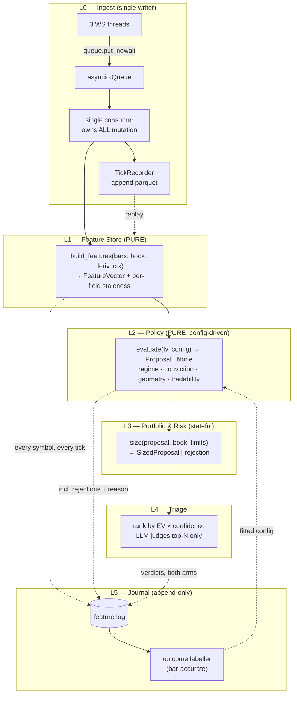

# QuantFlow — Improved Architecture & Features

> **Companion to** [Architecture_detailed_overview.md](Architecture_detailed_overview.md) (what exists) and
> [drawbacks_false_claimed.md](drawbacks_false_claimed.md) (what's broken).
>
> **This document is deliberately short on suggestions.** Everything proposed here is justified by a
> measured property of the current system, and §7 lists the things I considered and rejected, with reasons.
> If a change isn't traceable to the core goal, it isn't in here.

---

## 1. What this system is actually optimizing — and what it should be

The stated design centres on a **"Token-Saving Firewall"**: three deterministic gates whose purpose is to
avoid spending Gemini calls ([README §Layer 5](../../README.md), [reasoning_engine.py:143-163](trading_copilot/reasoning_engine.py#L143-L163)).

Measure the thing it's saving:

| Quantity | Value |
|---|---|
| Gatekeeper evaluations/day | 27 symbols × 2,250 ticks = **60,750** |
| LLM calls actually fired | gated by debounce + *state change* ([reasoning_engine.py:482](trading_copilot/reasoning_engine.py#L482)) → **tens per day**, not thousands |
| Input tokens per call | ~1,500 (payload) + ~2,000 (prompt) |
| Daily input tokens | order of **10⁵**, i.e. cents on Gemini 2.5 Flash |

**The firewall is optimizing a resource that costs almost nothing.** Meanwhile the two genuinely scarce
resources are untracked:

1. **Operator attention.** One person, 27 symbols, a 375-minute session. This is the real budget.
2. **Statistical validity.** 102 hardcoded thresholds (counted across `semantic_tagger`, `regime_manager`,
   `conviction_scorer`, `intraday_gatekeeper`, `mtf_extractor`), none fitted, with no mechanism that could
   ever fit them.

This reframing changes the design. The gate shouldn't be a **binary token filter** — it should be a
**ranking function over attention**. And the system's central missing capability isn't performance or
features; it's that **it cannot tell whether it works.**

### The core goal, restated

> Maximize the operator's decision quality per unit of attention — and be able to prove whether it does.

Everything below serves that sentence.

---

## 2. The one structural problem

The system generates signals, records outcomes, and feeds win rates back into weights
([conviction_scorer.py:18-40](trading_copilot/conviction_scorer.py#L18-L40)). That looks like a closed loop.
It isn't, for three reasons that compound:

**(a) The journal records conclusions, not evidence.**
[signal_ledger.py:44-56](trading_copilot/signal_ledger.py#L44-L56) stores 11 fields:
`ltp, regime, session_phase, composite_score, implied_probability, verdict, action_directive, bias,
padded_stop, calculated_target, calculated_entry`.

Not one of them is a **feature**. No `obi`, no `vol_z`, no `whale_cvd_slope`, no `iv_percentile`, no ATR.
So the richest question you can ask the archive is *"what is P(win | composite_score)?"* — a single scalar.
You cannot ask which inputs drove it, cannot do attribution, cannot retrain the scorer, cannot test a
threshold change. **The 102 constants are permanently unfalsifiable.**

**(b) Only winners-by-selection are recorded.**
Signals are logged only on `CONFIRM`/`ADJUST` with an actionable directive
([reasoning_engine.py:380-391](trading_copilot/reasoning_engine.py#L380-L391)). `ABORT` and `DEFER` vanish.
There is therefore **no counterfactual**, which makes the single most important question about this
architecture unanswerable: *does the LLM layer add value over the deterministic layer alone?*

**(c) Nothing can be replayed.** Ticks are consumed and discarded
([upstox_feed.py:236](trading_copilot/data_services/upstox_feed.py#L236) → `process_tick` → phantom candle).
Order-book snapshots are never persisted. So every change to the policy requires **weeks of live sessions**
to evaluate, and any historical evaluation of the microstructure half of the system is impossible forever.

**These three are one problem: the system has state but no memory.** Fix that and the 102 thresholds become
tunable, the LLM's value becomes testable, and every subsequent change becomes cheap to evaluate. Leave it
and every improvement below is guesswork.

---

## 3. Improved architecture

The current pipeline tangles feature computation, state mutation, and policy inside one function
([`build_structured_payload`](trading_copilot/reasoning_engine.py#L57-L119)) — which is precisely why a
2 Hz *display* call corrupts the decision path
([drawbacks §A-4](drawbacks_false_claimed.md#-a-4-the-regime-fsm-and-whipsaw-shield-are-defeated-by-a-second-20-faster-caller)).

The fix isn't a rewrite. It's separating **things that must be pure** from **things that own state**.



### 3.1 The property that matters: L1 and L2 are pure

```python
# L1 — no I/O, no globals, no clock
def build_features(bars: BarWindow, book: BookState,
                   deriv: DerivSnapshot, ctx: ContextSnapshot,
                   now: datetime) -> FeatureVector: ...

# L2 — no state mutation; same inputs always give same output
def evaluate(fv: FeatureVector, cfg: PolicyConfig) -> Proposal | Rejection: ...
```

Three things follow immediately, none of which are achievable today:

- **Replay works.** Feed recorded ticks → identical features → identical proposals. You can evaluate a
  threshold change against six months of history in seconds.
- **Tests work.** A golden `FeatureVector` fixture → assert on the `Proposal`. The volume bug
  ([§A-2](drawbacks_false_claimed.md#-a-2-phantom-candle-volume-accumulates-a-cumulative-counter)) and the
  `None.get()` crash ([§A-8](drawbacks_false_claimed.md#-a-8-signalledgerrecord_signal-raises-whenever-a-position-is-held))
  are both one-line unit tests.
- **The display path can't corrupt the decision path**, because there is nothing to corrupt — §A-4 becomes
  structurally impossible rather than fixed-by-flag.

State that genuinely must persist (regime FSM history, whipsaw counters, positions) moves to **L3**, which
has exactly one caller.

### 3.2 Config externalization

All 102 thresholds move out of code into a versioned file. The point is not tidiness — it's that
`evaluate(fv, cfg)` can then be **swept** over configs in replay.

```yaml
# config/policy/v1.yaml
version: 1
semantic:
  vol_z_shock: 2.5          # semantic_tagger.py:82
  vol_z_elevated: 1.0
  obi_extreme: 0.60
  obi_moderate: 0.20
  whale_slope_gate: 50      # see §4.4 — currently unnormalized, must become a ratio
  vwap_band_elevated: 0.75
  vwap_band_extreme: 1.50
conviction:
  bias_threshold: 0.15
  weights:
    TREND_EXPANSION:  {micro: 0.45, struct: 0.15, deriv: 0.15, cat: 0.25}
    RANGE_BOUND_CHOP: {micro: 0.20, struct: 0.30, deriv: 0.40, cat: 0.10}
gates:
  min_stat_edge: 0.05
  regime_dampening: {RANGE_BOUND_CHOP: 0.6, TRANSITIONAL_DRIFT: 0.7}
```

Every logged decision records `config_version`, so the journal stays interpretable across changes.

### 3.3 What replay can and cannot cover — an honest constraint

| Feature family | Replayable from | Available today? |
|---|---|---|
| RSI/MACD/BB/ATR/VWAP/CMF, geometry, candlesticks, camarilla, volume profile | 5-min OHLCV | ✅ 30 d in `ltf_df`, ~1,000 d daily in parquet |
| IV percentile, PCR percentile, max pain, OI shock | daily parquet | ✅ ~265 verified EOD rows/symbol |
| RS, alpha, beta | daily parquet | ✅ |
| **OBI, CVD, whale CVD, session VWAP, intraday POC** | **tick + order book** | ❌ **never persisted — gone forever** |

Roughly **60 % of the feature set is replayable today; the microstructure 40 % is not, and never will be
for past sessions.** Since microstructure carries the largest single weight in the composite
(`w_micro` up to 0.50, [conviction_scorer.py:8-13](trading_copilot/conviction_scorer.py#L8-L13)), that half
of the system is currently unvalidatable in principle.

**This is why tick recording is the highest-value single change in the document** — see §4.1.

---

## 4. Changes that earn their place

Ordered by impact on the core goal. Each states the evidence, the change, and what it unlocks.

---

### 4.1 Record raw ticks and full feature vectors

**Evidence.** Microstructure features are 40–50 % of the composite weight and are permanently
unvalidatable. `signal_snapshot` logs zero features. Only ~tens of signals/day are logged, so even a naive
calibration needs months.

**Change — two append-only writers.**

```python
# L0 — tick recorder. Batched, columnar, off the event loop.
class TickRecorder:
    def __init__(self, data_dir: Path, flush_n: int = 20_000):
        self._buf: list[tuple] = []
        self._flush_n = flush_n

    def record(self, token: str, ts_ms: int, ltp: float, vtt: float,
               oi: float, bid1: float, ask1: float,
               bid_qty: int, ask_qty: int) -> None:
        self._buf.append((token, ts_ms, ltp, vtt, oi, bid1, ask1, bid_qty, ask_qty))
        if len(self._buf) >= self._flush_n:
            self._schedule_flush()          # asyncio.to_thread -> parquet append
```

```python
# L5 — feature log. EVERY symbol, EVERY gatekeeper tick, not just signals.
@dataclass(frozen=True)
class FeatureRecord:
    ts: int; symbol: str; config_version: int
    features: dict[str, float]              # the full ~120-field vector
    staleness: dict[str, float]             # seconds since each source last updated
    regime: str; session_phase: str
    composite: float | None
    decision: str                            # PROPOSED | REJECTED_<reason> | GATED_<reason>
    llm_verdict: str | None                  # None when not escalated
```

**Volume — measured, not guessed.**

| Stream | Rows/day | Approx. size |
|---|---|---|
| Ticks (27 × ~4/s × 375 min) | ~2.4 M | ~40–60 MB/day compressed parquet |
| Feature vectors (27 × 2,250) | 60,750 | ~25–30 MB/day |

Under **1 GB/month**. Trivially affordable, and it is the difference between a system that can be improved
and one that cannot.

**What it unlocks — the key point:** logging *every* evaluation rather than only signals gives ~60,750
labelled observations **per day**. Attach forward returns and within a month you have >1 M rows across the
full cross-section. That is enough to genuinely fit thresholds, measure feature importance, and answer
"does the microstructure block predict anything?" — questions the current design can never ask.

---

### 4.2 Replace the invented probability with a measured one — or with nothing

**Evidence.** `p_implied = 0.50 + 0.85·(σ(4.5·|composite|) − 0.50)`
([conviction_scorer.py:265-269](trading_copilot/conviction_scorer.py#L265-L269)). The constants 4.5 and 0.85
are unfitted. The floor is ~64 % — the *weakest admissible* signal is reported as a 64 % probability trade.
This number is shown to the operator as `Confidence_Score` and handed to the LLM as
*"ground truth"* ([reasoning_engine.py:191-193](trading_copilot/reasoning_engine.py#L191-L193)).

**Change.** Three-stage, honest at each stage:

```python
def implied_probability(composite: float, regime: str, cal: Calibration | None) -> float | None:
    if cal is None or cal.n_resolved < cal.MIN_N:      # MIN_N ≈ 200
        return None                                     # say "unknown", don't invent
    return cal.predict(abs(composite), regime)          # fitted offline from the journal
```

- **Stage 1 (now):** return `None`. UI shows `R:R 1 : 2.3` and `edge: unmeasured`. The prompt drops the
  probability claim. Strictly more honest and costs nothing.
- **Stage 2 (~200 resolved signals):** one-feature logistic on `|composite|`, refit nightly, with a
  **reliability curve** in the UI (predicted vs realized, decile buckets). If the curve is flat, the score
  has no discriminative power — and you'll know.
- **Stage 3 (~5,000+ feature rows):** multi-feature model over the §4.1 log, with proper walk-forward
  validation. Only if Stage 2 shows real signal.

**Do not skip to Stage 3.** With tens of signals/day, a multi-feature model would fit noise.

**Also fix the weight-normalization bug** while here — `catalyst_norm` is hardcoded `0.0` but `w_cat`
(0.10–0.25) is still multiplied in, so max `|composite|` is 0.75 in `TREND_EXPANSION`, and the deflation
*varies by regime*, making scores non-comparable across regimes
([§C-1](drawbacks_false_claimed.md#-c-1-implied_probability-is-a-fabricated-statistic-and-the-catalyst-weight-caps-it)).
Renormalize over live weights only.

---

### 4.3 Add the risk layer — the system currently answers "what" but not "how much"

**Evidence.** Verified by grep: **no `position_size`, `capital`, `risk_per_trade`, `max_loss`, or
`exposure` anywhere in the codebase.** The pipeline emits entry/stop/target and stops. `charges` exists only
as a manually-typed field on trade exit
([api_server.py:410](trading_copilot/api_server.py#L410)) — never modelled, never in the expectancy math.

And the watchlist is severely concentrated:

| Cluster | Count | Members |
|---|---|---|
| **Adani group** | **4 / 27** | ADANIENSOL, ADANIENT, ADANIGREEN, ADANIPORTS |
| Power / capital goods | **7 / 27** | TATAPOWER, POWERINDIA, CGPOWER, BHEL, SUZLON, ADANIGREEN, ADANIENSOL |
| PSU metals / infra | 5 / 27 | SAIL, NMDC, NBCC, SCI, BHEL |
| Financials | 7 / 27 | IDFCFIRSTB, YESBANK, KOTAKBANK, ANGELONE, MCX, 360ONE, SAMMAANCAP |

On a day when the power theme moves, this pipeline can emit **seven simultaneous LONG signals that are one
bet.** Nothing in the system notices. That is not a polish item — it's the difference between a 1 R risk and
a 7 R risk on a single thesis.

**Change — a new L3 between policy and triage.**

```python
@dataclass
class RiskLimits:
    capital: float
    risk_per_trade_pct: float = 0.5      # of capital, at the stop
    max_daily_loss_pct: float = 2.0
    max_cluster_risk_pct: float = 1.0    # aggregate across correlated names
    max_adv_participation: float = 0.02  # never size beyond 2% of 20d avg volume

def size(p: Proposal, book: Portfolio, lim: RiskLimits, adv: float) -> SizedProposal | Rejection:
    risk_per_share = abs(p.entry - p.stop)
    if risk_per_share <= 0:
        return Rejection("DEGENERATE_STOP")

    qty = int((lim.capital * lim.risk_per_trade_pct / 100) / risk_per_share)
    qty = min(qty, int(adv * lim.max_adv_participation))          # liquidity cap

    cluster = CLUSTER_MAP.get(p.symbol, p.symbol)                  # §4.3.1
    open_risk = book.risk_in_cluster(cluster)
    headroom = lim.capital * lim.max_cluster_risk_pct / 100 - open_risk
    if headroom <= 0:
        return Rejection(f"CLUSTER_LIMIT_{cluster}")
    qty = min(qty, int(headroom / risk_per_share))

    if book.realized_loss_today >= lim.capital * lim.max_daily_loss_pct / 100:
        return Rejection("DAILY_LOSS_LIMIT")

    return SizedProposal(**vars(p), qty=qty, risk_amount=qty * risk_per_share)
```

**4.3.1 Clusters.** Don't over-engineer this. A **static sector/group map in YAML** covering the actual
watchlist is ~30 lines and captures the Adani and power exposures immediately. Rolling 60-day return
correlation from the daily parquet is a strictly better *later* refinement — but the static map delivers
90 % of the value on day one and is far easier to reason about.

**4.3.2 Cost model — currently absent, and material.**

For Indian intraday equity the round trip is roughly **0.05–0.10 %** (brokerage, STT on sell, exchange
transaction charges, SEBI fee, stamp duty, GST on the charge components), plus spread. Against a minimum
target of `1.5 × ATR₁₅ₘ` — which on a mid-cap can be ~0.3–0.5 % — costs consume a **meaningful double-digit
percentage of gross reward**, and the current expectancy math accounts for none of it. The only nod to cost
is `± 0.1 × atr_5m` ([conviction_scorer.py:262-263](trading_copilot/conviction_scorer.py#L262-L263)), which
models slippage, not charges.

```python
# config/costs.yaml — VERIFY against your actual broker's rate card; these rates change.
intraday_equity:
  brokerage_pct: 0.03        # or flat_fee: 20, whichever is lower
  brokerage_cap: 20
  stt_sell_pct: 0.025
  exchange_txn_pct: 0.00297
  sebi_pct: 0.0001
  stamp_duty_buy_pct: 0.003
  gst_pct: 18                # on brokerage + txn + sebi
```

Then `p_breakeven` uses `effective_reward = gross_reward − round_trip_cost − spread`. Some currently-passing
setups will correctly stop passing. **That is the point** — they were never profitable.

---

### 4.4 Fix the horizon incoherence

**Evidence.** Three different horizons are in play simultaneously:

| Component | Horizon | Source |
|---|---|---|
| LLM system prompt | **"2–6 hour intraday predictive horizon"** | [index.html:1584](trading_copilot/templates/index.html#L1584) |
| Outcome measurement | **30 min / 60 min** | [signal_ledger.py:67-68](trading_copilot/signal_ledger.py#L67-L68) |
| Forced square-off | **15:20 IST** | [intraday_gatekeeper.py:49](trading_copilot/intraday_gatekeeper.py#L49) |
| "Failure to launch" abort | **45 min** | [intraday_gatekeeper.py:117](trading_copilot/intraday_gatekeeper.py#L117) |

A signal generated at 13:00 with a "2–6 hour" thesis is force-closed at 15:20 (2 h 20 m), so the upper half
of the stated horizon is **unreachable within a session**. It's then graded at 30/60 min — one quarter to
one twelfth of its claimed horizon — and abandoned at 45 min if flat.

**You cannot optimize a system whose target variable disagrees with its own exit rules.** The feedback loop
is currently training weights on a 30-minute objective while the prompt argues for a multi-hour thesis.

**Change.** Declare one primary horizon and make everything agree:

```yaml
horizon:
  primary_minutes: 90              # must satisfy: entry_cutoff + primary <= 15:20
  entry_cutoff_ist: "13:45"        # no new entries that can't run their full horizon
  measure_at: [30, 90, "close"]    # 30m as an early read; 90m is the objective
  stagnation_abort_minutes: 60     # must be >= a meaningful fraction of primary
```

Then: the prompt states the same number, `PerformanceAnalyzer` optimizes `win_rate_90m`, and the gatekeeper
refuses entries after `entry_cutoff_ist`. Keep the 30 m measurement as a diagnostic, not the objective.

---

### 4.5 Answer the question the system was built around: does the LLM help?

**Evidence.** The whole architecture is premised on the LLM adding qualitative judgment over the math layer.
Because only `CONFIRM`/`ADJUST` are journalled, **that premise has never been tested and cannot currently
be tested.**

**Change — shadow mode. Log both arms, always:**

```python
# L4, for every proposal that clears the deterministic gate
journal.write(ArmRecord(
    symbol=p.symbol, ts=now, config_version=cfg.version,
    math_arm={"action": p.bias, "entry": p.entry,
              "stop": p.stop, "target": p.target},
    llm_arm={"verdict": t.verdict, "action": t.action_directive,
             "entry": t.final_entry, "stop": t.final_stop, "target": t.final_target},
    escalated=True,
))
```

Then label **both** arms with the same outcome resolver. After a few hundred escalations you can report:

| Metric | Math-only | Math + LLM |
|---|---|---|
| Win rate @ 90 m | — | — |
| Avg R multiple | — | — |
| Signals taken | — | — |
| **LLM veto precision** (ABORTs that would have lost) | n/a | — |

If the LLM's ABORTs are no better than random, the layer is expensive theatre and the money is better spent
elsewhere. If its vetoes are precise, that quantifies exactly what it's worth. **Either answer is valuable;
not knowing is the only bad outcome.** This is ~30 lines of logging.

---

### 4.6 Convert the gate into a ranked attention queue

**Evidence.** Token cost is negligible (§1). The binding constraint is one operator watching 27 symbols.
The current design answers a per-symbol boolean — *"does SAIL pass?"* — when the operator's actual question
is *"what deserves my attention right now, and why?"*

The pieces are already there: `Priority_Score` and `Confidence_Score` are computed
([intraday_gatekeeper.py:146-147](trading_copilot/intraday_gatekeeper.py#L146-L147)) but only used as card
decorations, never to order anything.

**Change.**

```python
def attention_rank(sp: SizedProposal) -> float:
    ev_r = sp.p_win * sp.reward_r - (1 - sp.p_win) * 1.0   # in R multiples
    conf = sp.calibration_confidence                        # 0 when uncalibrated (§4.2)
    freshness = clamp(1.0 - sp.max_staleness_s / 30.0, 0, 1)
    return ev_r * (0.5 + 0.5 * conf) * freshness
```

Present the **top 3–5**, always sorted, with the rest collapsed. Escalate to the LLM only for the top N —
which incidentally saves far more tokens than the current firewall, as a side effect rather than a goal.

**Also fix the debounce asymmetry.** Today, `if count < 3: continue`
([reasoning_engine.py:476-477](trading_copilot/reasoning_engine.py#L476-L477)) suppresses the **UI card**
as well as the LLM call. The debounce should gate escalation only; the operator should always see current
state, with an `unstable` marker during the settling window.

---

### 4.7 Keep the semantic tags — stop discarding the numbers

**Evidence.** The stated rationale is that compression *"prevents the LLM from hallucinating on arbitrary
numbers"* ([README §Layer 3](../../README.md)). But the compression is lossy exactly where magnitude matters most:
`vol_z = 2.6` and `vol_z = 8.0` both become `TIME_ADJUSTED_SHOCK`
([semantic_tagger.py:82-83](trading_copilot/semantic_tagger.py#L82-L83)); `obi = 0.61` and `obi = 0.98` both
become `EXTREME_BID_DOMINANCE`.

The anti-hallucination benefit comes from giving the model **units and reference context**, not from
withholding information.

**Change — emit both. It's nearly free in tokens and strictly more informative:**

```json
"volume_regime": {
  "state": "TIME_ADJUSTED_SHOCK",
  "vol_z": 3.4,
  "pctile_vs_20d": 0.97,
  "note": "z-score vs same-time-of-day baseline, 22 sessions"
}
```

Keep the tag as the UI label and the categorical the scorer buckets on; add the scalar for the LLM and for
the §4.1 feature log. **This is also a prerequisite for §4.1** — you cannot fit thresholds on data that was
already thresholded.

---

### 4.8 Make data staleness a first-class signal

**Evidence.** [§A-12](drawbacks_false_claimed.md#-a-12-no-websocket-reconnection--a-dropped-stream-is-silent-and-permanent):
if a WebSocket stream dies, `_on_close` only logs, there's no reconnect, and the UI's green
**"Connected Live"** dot reflects the *browser↔gateway* socket, not *gateway↔exchange*. The operator keeps
seeing confident signals computed on a frozen snapshot with no indication anything is wrong.

Compounding it, three data sources have wildly different natural latencies and none are labelled:

| Source | Update cadence |
|---|---|
| Ticks | sub-second |
| Derivatives (PCR / max pain / IV) | ~4–6 min actual ([§B-19](drawbacks_false_claimed.md#b1-verdicts)) |
| FII/DII | daily, **and only if `macro_worker` was launched manually** |
| Macro baselines | regenerated by hand |

**Change.** Stamp every feature with its source timestamp, propagate a per-block `age_seconds`, and let
policy react rather than silently trusting stale inputs:

```python
if fv.staleness["microstructure"] > 15.0:      # market hours
    return Rejection("STALE_MICROSTRUCTURE")
if fv.staleness["derivatives"] > 900.0:
    fv = fv.without_block("derivatives")        # degrade, don't fabricate
```

In the UI: a per-block freshness strip, and a hard **STALE** banner that is visually impossible to miss.
A system that says "I don't know right now" is more useful than one that quietly guesses.

---

### 4.9 Close the discovery loop

**Evidence.** `PreMarketScreener` scans the whole F&O universe and ranks it
([screener_engine.py:107-163](trading_copilot/screener_engine.py#L107-L163)), but
`_update_watchlist` is **never called** ([:165-176](trading_copilot/screener_engine.py#L165-L176)). The
watchlist is hand-curated and static. So discovery and monitoring are two disconnected systems — the
screener's output goes into an LLM playbook that a human reads, and nothing flows back.

Meanwhile the screener's own ranking is broken: its volume-shock term saturates at ratio 1.0, awarding full
marks to any stock trading at merely average volume
([§A-15](drawbacks_false_claimed.md#-a-15-screeners-volume-shock-term-is-a-constant-for-most-stocks)).

**Change.** Fix the scoring, then make the loop explicit and bounded:

```yaml
watchlist:
  core: [RELIANCE, INFY, KOTAKBANK]     # always monitored, operator-pinned
  dynamic_slots: 12                      # screener-managed
  refresh: "08:45"                       # pre-open, once
  cluster_cap: 2                         # ≤2 names per cluster (§4.3.1)
  min_adv_crore: 50                      # tradability floor
  churn_cap: 4                           # ≤4 swaps/day — warmup costs ~90-150s
```

The `cluster_cap` matters: without it a screener sweeping a trending theme would fill every slot with
correlated names — exactly the concentration problem §4.3 identifies, but automated.

---

### 4.10 Make ingestion genuinely single-writer

**Evidence.** [§A-2](drawbacks_false_claimed.md#-a-2-phantom-candle-volume-accumulates-a-cumulative-counter)
(VTT differenced in one subsystem, summed raw in another),
[§A-3](drawbacks_false_claimed.md#-a-3-microstructure-state-is-never-reset-across-days--the-next-session-starts-blind)
(two of four state dicts miss the daily reset), and the unsynchronized `pd.concat` on `ltf_df` while three
OS threads mutate `phantom_candles` — these are all the same root cause: **shared mutable state with no
owner**, and an incorrect GIL-safety comment asserting otherwise
([upstox_feed.py:289](trading_copilot/data_services/upstox_feed.py#L289)).

**Change — ~60 lines, retires an entire defect class:**

```python
# upstox_feed.py — WS threads only enqueue. They touch nothing shared.
def _on_market_update(self, message):
    for ikey, feed in (message.get("feeds") or {}).items():
        tick = parse_tick(ikey, feed)
        if tick:
            self.loop.call_soon_threadsafe(self.tick_q.put_nowait, tick)

# rolling_state_engine.py — one consumer owns every mutation.
async def ingest_loop(self):
    while True:
        tick = await self.tick_q.get()
        if self._is_new_session(tick.ts):
            self._reset_session_state()      # ONE place — §A-3 cannot recur
        self.recorder.record(tick)           # §4.1
        self.process_tick(tick)
```

Beyond correctness this yields a **queue-depth metric**, which is the single best liveness signal you can
have: depth climbing means the consumer is falling behind; depth pinned at zero during market hours means
the feed is dead. Both are actionable, and neither is currently observable.

---

## 5. Feature additions for the operator

Only where they change a decision. No dashboards for their own sake.

### 5.1 Signal provenance panel

The operator currently sees `composite_score: 0.34` with no attribution. Show the decomposition:

```
SAIL · LONG · rank 1 of 3            composite 0.34   R:R 1 : 2.1
─────────────────────────────────────────────────────────────────
micro    +0.42 × 0.45 = +0.19   flow MOMENTUM_BULL (slope +2.1σ)
                                 obi  EXTREME_BID (0.71)
struct   +0.33 × 0.15 = +0.05   at 20d VAL, testing from above
deriv    +0.67 × 0.15 = +0.10   pcr 84th pctile
catalyst   —    × 0.25 =  0.00   ⚠ no catalyst input (see §C-1)
─────────────────────────────────────────────────────────────────
edge     unmeasured (n=41 < 200)   staleness: micro 0.4s · deriv 271s
```

This is what lets an operator calibrate their *own* trust — and the `⚠` on the dead catalyst term makes a
known structural gap visible instead of silent.

### 5.2 Calibration / reliability view

Predicted probability decile vs realized win rate, with sample counts. This is the honest answer to "should
I believe the confidence score?" — and when the curve is flat, it says so.

### 5.3 Exposure view

Given §4.3's clusters: current open risk by cluster against limits. One glance answers "am I already loaded
on the power theme?"

### 5.4 Replay / paper mode

Run the pipeline over a recorded session at Nx speed, producing the same journal records with
`mode: replay`. This is what makes every other change cheap to evaluate, and it doubles as the safest way
to validate a config change before it touches a live session.

### 5.5 Session review

An end-of-day summary: signals emitted, outcomes at the primary horizon, best/worst by cluster and regime,
config version, and any staleness incidents. Five minutes of daily review compounds far faster than any
individual threshold tweak.

---

## 6. Migration path

Incremental. Nothing here requires a rewrite, and each phase is independently useful.

| Phase | Work | Unlocks |
|---|---|---|
| **0** | All of [drawbacks §G Phase 1](drawbacks_false_claimed.md#phase-1--stop-showing-wrong-numbers-half-a-day) — fabricated macro, VTT bug, daily resets, paths, alert endpoints | Numbers mean what they say. **Do not skip; everything downstream inherits this data.** |
| **1** | §4.1 tick + feature recording (add alongside existing code — pure addition, no behaviour change) | The clock starts on the dataset. Do this *first*; its value compounds daily. |
| **2** | §4.10 queue-based ingest; §3.1 extract pure `build_features` / `evaluate`; §3.2 config to YAML | Replay + tests become possible. §A-4 becomes structurally impossible. |
| **3** | §4.3 risk layer; §4.4 horizon; §4.7 tags+values | The two functional gaps (sizing, correlation) close. |
| **4** | §4.2 calibration; §4.5 shadow mode; §5.2 reliability view | The system starts telling you whether it works. |
| **5** | §4.6 ranked queue; §4.8 staleness; §4.9 discovery loop; §5.x views | Operator-facing quality. |

**Phase 1 before Phase 2.** Recording is additive and low-risk, and every day it's deferred is a day of
training data lost forever. The refactor can proceed while data accumulates.

---

## 7. Considered and rejected

The user asked for effective changes, not a wish list. These were evaluated and deliberately excluded.

| Rejected | Why |
|---|---|
| **Rewrite in Rust/Go, or swap the async framework** | The bottleneck is ~30k needless Python calls/sec from unvectorized loops ([§D-3](drawbacks_false_claimed.md#-d-3-full-recomputation-of-1650-row-indicators-to-use-one-value)) and ~100 disk scans/sec from a missing cache ([§D-1](drawbacks_false_claimed.md#-d-1-the-ledger-is-re-read-from-disk-100-times-per-second)). Both are fixed with `np.bincount` and a TTL dict. At 27 symbols and 4 ticks/sec, Python is nowhere near its limit. |
| **Collapse the 4 processes into one, or split further** | The process boundary provides real fault isolation. The problem is the *transport* (2 Hz JSON polling of full state, §D-5), not the topology. Fix the transport. |
| **Postgres / TimescaleDB / Redis** | Parquet + JSONL handles ~1 GB/month single-writer, single-reader, with zero operational surface. Introduce a database when there's a query pattern that files can't serve — there isn't one yet. |
| **Kubernetes, Docker, Prometheus/Grafana** | Single operator, single machine. A queue-depth number and a staleness field (§4.8, §4.10) deliver the observability that actually matters here. |
| **More indicators (Ichimoku, supertrend, order-flow imbalance variants…)** | The system already computes ~120 features governed by 102 unfitted thresholds. Adding features before the existing ones are validated makes the fitting problem harder, not the system better. |
| **Replace the scorer with an ML model now** | Nothing to train on: features aren't logged, and signals number in the tens per day. Ask again after §4.1 has run for a month. Doing it sooner would fit noise. |
| **A bigger/reasoning LLM, or more frequent LLM calls** | The LLM layer's value is **unmeasured** (§4.5). Spending more on an unquantified component is exactly backwards. Measure first; scale only what's shown to work. |
| **Broker order placement / full automation** | Out of scope for the stated goal, and irresponsible while the confidence score is uncalibrated (§4.2) and there's no risk layer (§4.3). Revisit only after Phase 4 shows measured edge. |
| **Rewrite the UI in React/Vue** | 2,771 lines of vanilla JS that works. The UI's defects are missing endpoints, a fabricated data fallback, and dead controls — none of which a framework fixes. |
| **Multi-user / auth system / cloud hosting** | Single operator. Bind to `127.0.0.1` ([§E-1](drawbacks_false_claimed.md#e--security-and-operations)) and the security problem is solved for the actual threat model. |
| **Options strategies, multi-leg, or a Greeks engine** | The system reads options data as *equity context* (PCR, max pain, IV as sentiment). Trading options is a different product with different risk machinery. Don't blur the scope. |
| **Tick-level backtest engine with an order-book simulator** | Disproportionate. §5.4 replay over recorded ticks answers the questions that matter, at a fraction of the complexity. |

---

## 8. Summary

The current system's real problem isn't its bug list — those are fixable in a week
([drawbacks §G](drawbacks_false_claimed.md#g--better-approach--prioritised-remediation)). It's that
**102 unfitted constants govern its behaviour and nothing in the design can ever tell you whether any of
them is right.**

Four changes carry nearly all the value:

1. **Record ticks and full feature vectors** (§4.1) — turns an unfalsifiable system into a measurable one,
   at <1 GB/month, and yields ~60k labelled observations per day rather than ~tens.
2. **Make L1/L2 pure and config-driven** (§3.1, §3.2) — makes replay, testing, and threshold sweeps
   possible; makes the §A-4 state-corruption class impossible rather than patched.
3. **Add the risk layer** (§4.3) — sizing, cluster limits, and a real cost model. The system currently
   recommends trades without a quantity and can put 7× the intended risk on one theme.
4. **Stop asserting confidence you haven't measured** (§4.2, §4.5, §4.8) — report `None` until calibrated,
   log both arms so the LLM's contribution is finally quantifiable, and surface staleness instead of
   silently trusting frozen data.

Everything else in this document is refinement. Those four change what the system fundamentally *is*: from
a sophisticated apparatus that cannot be evaluated, into one that improves every session it runs.
